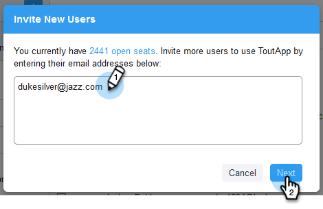

# 邀请用户 {#invite-users}

添加用户既快速又简单！

1. 单击齿轮图标并选择 **设置**.

   

1. 在管理设置下，选择 **User Management**.

   

1. 单击 **邀请用户**.

   

1. 输入要添加的个人的电子邮件地址，然后单击 **下一个**.

   

   >[!NOTE]
   >
   >默认情况下，所有新成员都将添加到Everyone团队。

1. 单击 **确定**.

   
