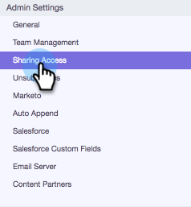

# 共享设置 {#sharing-settings}

通过限制用户可以共享的内容以及与哪些类别共享，更好地管理模板。

首次创建Sales Connect帐户时，将启用共享设置。 这样，您的帐户管理员就有机会在打开闸门之前创建和组织您的模板类别，并允许用户将内容共享到您的团队类别。

启用“共享设置”后，只有管理员才能共享到类别，除非向团队或所有人提供共享权限。 禁用“共享设置”后，不存在任何限制，所有用户都可以共享到任何模板类别。

## 配置共享设置 {#configure-your-sharing-settings}

1. 在Web应用 [程序中](http://toutapp.com/login)，转到“设置”页。

   

1. 在“管理员设置”下，选择“ **共享访问权**”。

   

1. 确保已 **启用“共享** 设置”。 这意味着，默认情况下，只有管理员才能在您的模板类别中共享模板。

   

1. 选择要配置的模板类别。

   

1. 单击“ **添加团队以进行访问**”。

   

1. 选择要添加的团队。

   

   >[!NOTE]
   >
   >如果您没有看到任何团队，您将需要转到团队管理并创建一组用户。

1. 单击“ **添加团队以进行访问** ”以进行保存。

   

1. 添加团队后，您可以选择仅允许团队管理员共享该团队或该团队中的所有用户。 在此示例中，我们授予SDR团队的所有用户共享访问权限。

   

