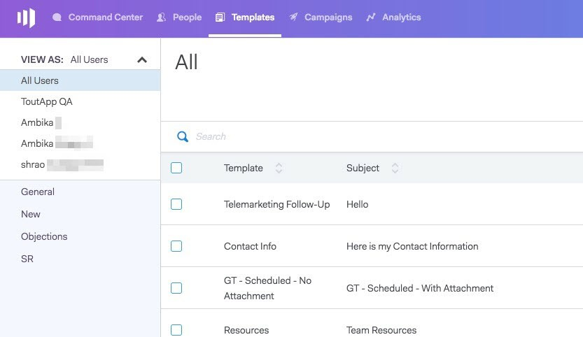

# 用户访问详细信息 {#user-access-details}

管理员和非管理员可以访问什么？

## 管理员用户权限 {#admin-user-permissions}

管理员可以 [查看所有模板](/help/marketo/product-docs/marketo-sales-connect/templates/view-template-list-as-another-user.md).

管理员可以 [查看所有营销活动](/help/marketo/product-docs/marketo-sales-connect/campaigns/view-campaigns-list-as-another-user.md).

管理员可以查看所有电子邮件活动。

管理员可以在某个正在运行的营销活动中看到所有人员。

可以在Everyone组中访问所有人员记录。

管理员可以代表用户停止营销活动。

## 非管理员用户权限 {#non-admin-user-permissions}

* Analytics:

   * 用户可以查看团队分析
   * 用户可以只深入查看他们所属的团队
   * 用户可以查看自己的分析

* “关系”页：

   * 用户可以与所有人共享组
   * 用户可以仅与他们所属的团队共享组
   * 删除某个用户后，其共享联系人会将所有权转移给删除该用户的主控管理员

* 销售节拍 — 下一个和实时信息源：

   * 用户可以查看“所有人”视图
   * 用户可按其所属的团队进行筛选
   * 用户可以与所有人共享帖子
   * 用户可以仅与属于自己的团队共享帖子

* “团队管理”页：

   * 无法查看

* “模板”页面：

   * 用户可以与所有人共享模板
   * 用户可以在管理员允许的类别中共享模板
   * 从团队中删除用户后，其模板将取消与该团队共享
   * 从团队中删除用户后，其模板会将所有权转移给删除该用户的主控管理员
