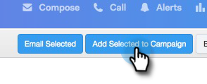

# 添加到营销活动{#add-to-marketing-campaign}

>[!PREREQUISITES]
>
>[使活动对销售用户可见](/help/marketo/product-docs/marketo-sales-connect/marketo/make-a-campaign-visible-to-sales-connect-users.md)

## 将个人添加到活动{#add-individuals-to-a-campaign}

>[!NOTE]
>
>要从Sales Connect将人员添加到Marketo活动,Sales Connect必须具有该人员的Marketo潜在客户ID。 [在此处了解如何捕获Marketo ID](/help/marketo/product-docs/marketo-sales-connect/people/managing-contacts/connect-your-marketo-leads-with-sales-connect-leads.md)。

1. 单击&#x200B;**People**&#x200B;选项卡。

   

1. 查找要添加的联系人。

   

1. 单击此复选框以选择您的联系人。

   

1. 单击&#x200B;**将选定内容添加到活动**。

   

1. 由于您正在添加到营销活动，请跳过选择“发件人”地址。 但是，您可以选择添加更多联系人。 如果选择，请单击“个人”，然后在中键入这些个人。 完成后，单击&#x200B;**Next**。

   

1. 单击&#x200B;**营销活动**。

   

1. 单击“工作区”(Workspaces)下拉框，然后选择包含要将组添加到的活动的工作区。

   

   >[!NOTE]
   >
   >如果您看不到所需的工作区，请确保您的管理员通过您的“Marketo团队访问”页面设置工作区。

1. 选择所需的活动，然后单击&#x200B;**下一步**。

   

1. 您已显示符合条件的联系人。 单击&#x200B;**开始**&#x200B;以添加它们。

   

## 将组添加到活动{#add-a-group-to-a-campaign}

1. 单击&#x200B;**People**&#x200B;选项卡。

   

1. 在“我的组”下，选择要添加到活动的组。

   

1. 单击&#x200B;**将组添加到活动**。

   

1. 由于您正在添加到营销活动，请跳过选择“发件人”地址。 但是，您可以选择添加更多联系人。 如果选择，请单击“个人”，然后在中键入这些个人。 完成后，单击&#x200B;**Next**。

   

1. 选择&#x200B;**营销活动**。

   

   >[!NOTE]
   >
   >要从Sales Connect将人员添加到Marketo活动,Sales Connect必须具有该人员的Marketo潜在客户ID。 [在此处了解如何捕获Marketo ID](/help/marketo/product-docs/marketo-sales-connect/people/managing-contacts/connect-your-marketo-leads-with-sales-connect-leads.md)。

1. 单击“工作区”(Workspaces)下拉框，然后选择包含要将组添加到的活动的工作区。

   

   >[!NOTE]
   >
   >如果您看不到所需的工作区，请确保您的管理员通过您的“Marketo团队访问”页面设置工作区。

1. 选择所需的活动，然后单击&#x200B;**下一步**。

   

1. 您已显示符合条件的联系人。 单击&#x200B;**开始**&#x200B;以添加它们。

   
