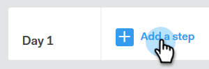

# 创建活动 {#create-a-campaign}

活动是一系列多渠道步骤，包括：电子邮件、电话、InMail和自定义任务。 它们使您能够简化与潜在客户和现有客户的沟通。

利用活动，您可以：

* **组织**:在一个位置简化所有外联活动，以有效执行。

* **缩放**:计划您的所有外联工作，以便扩展工作规模、最大限度地减少手工工作并按需个性化。
* **度量**:在将所有电子邮件和任务自动登录Salesforce的同时，在一个位置跟踪其成功情况。 通过了解产生共鸣和产生结果的原因，您可以一致地测试和改进结果。

那你怎么设置活动?

1. 单击“ **活动** ”选项卡。

   

1. 选择类别，然后单 **击创建活动** 按钮以创建新活动。

   

   >[!NOTE]
   >
   >通过单击类别旁的** +**创建新类别 ****。

1. 您选择的类别将被选中。 如果您改变了主意，请单击下拉框，然后选择其他下拉框。 完成后，单击“继 **续”**。

   

1. 单击 **添加步骤**。

   

1. 在以下选项中进行选择：电子邮件、呼叫、InMail或自定义任务。 在此示例中，我们选择“电 [子邮件](http://docs.marketo.com/display/DOCS/Campaign+Step+Types#CampaignStepTypes-Email)”。

   

1. 创建第一天和第一步后，“添加一天”按钮将激活，您可以根据销售流程的需要添加任意天数和步骤。

   

   >[!NOTE]
   >
   >“天数”不是操作之间的天数，而是序列中的天数。 例如，如果您的活动将持续7天，则输入“3”表示操作将在第3天（共7天）开始， **不会**3天后开始。

1. 通过访问活动的“设置”选项卡，确保自定义日程安排和回复选项，如跳过周末(这 **太棒了** )。

   

   现在是时候开始给活动添人了！

