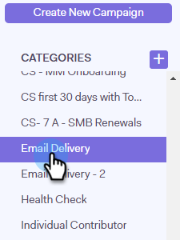
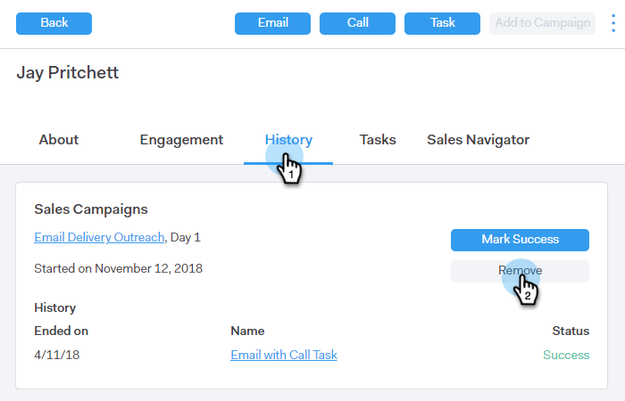

# 从营销活动中删除人员 {#remove-people-from-a-campaign}

您可以在收件人回复时自动结束Campaign。 此外，您可以选择将该营销活动标记为该收件人的“成功”。

要设置此项，在创建营销活动后，只需选中“营销活动”选项卡的“设置”部分中的“取消订阅”框。 这两个选项都将结束营销活动，并且您的收件人不会再收到您发来的任何电子邮件。 要使此功能正常工作，您必须具有回复跟踪。

此外，您还可以从营销策划本身删除人员，在“人员”页面中将人员从营销策划中删除，以及删除整个人员组。 下面我们看一下所有三种方法。

## 直接从营销策划中删除人员 {#remove-a-person-directly-from-a-campaign}

1. 在Sales Connect中单击 **营销活动** 选项卡。

   

1. 找到并选择您的营销策划。

   

1. 您的营销活动将显示在右侧。 单击其上的任意位置以将其打开。

   

1. 查找要删除的人员，然后单击 **移除**.

   

1. （可选步骤）您也可以通过单击多个人员的名称旁边的复选框并单击 **移除** 按钮。

   

## 在人员页面中，从营销活动中删除人员 {#remove-a-person-from-a-campaign-within-the-people-page}

1. 在Sales Connect中单击 **人员** 选项卡。

   

1. 查找并选择您要删除的人员。

   

1. 将在右侧打开其“人员详细信息”视图面板。 单击 **历史记录** 选项卡，然后 **移除** 按钮。

   

## 从营销活动中删除一组人员 {#remove-a-group-of-people-from-a-campaign}

1. 在Sales Connect中单击 **人员** 选项卡。

   

1. 在以下位置查找并选择您的组： **我的组**.

   

1. 选择要删除的人员。

   

1. 单击 **操作** 并选择 **从营销活动中删除选定项**.

   
