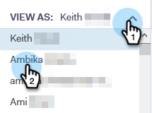

# 以其他用户身份查看营销活动列表 {#view-campaigns-list-as-another-user}

作为管理员，您可以以任意用户的身份查看营销活动。

>[!NOTE]
>
>**需要管理员权限**

1. 在Web应用程序中，单击 **营销活动**.

   

1. 单击 **查看方式** 下拉列表并选择所需的用户。

   

1. 您现在会以选定用户的身份查看营销活动。

   

   >[!NOTE]
   >
   >您还可以使用筛选器或搜索功能以及查看方式，以查看与您最相关的内容。
