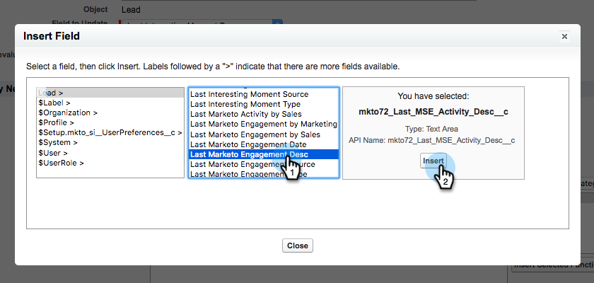

# 在Salesforce中创建工作流规则 {#creating-workflow-rules-in-salesforce}

当同时使用Marketo Sales Insight(MSI)和Marketo Sales Connect(MSC)时，Salesforce中的MSI最佳选择功能将不会更新。 所有其他MSI功能均可正常使用（查看iFrame中的有趣时刻、发送电子邮件、添加到营销活动等）。 本文提供了使“最佳下注”再次工作的解决方法。

>[!NOTE]
>
>这仅会影响使用 **both** MSI和MSE，以及希望使用MSI中最佳选择功能的用户。 如果您不需要/使用“最佳下注”，则可以忽略。

## 快速入门 {#getting-started}

解决方法包括创建新的工作流规则，以将新MSE字段的值复制到旧MSI字段中。 您需要为Contact对象创建四个工作流规则，并在您自己的Salesforce实例中为Lead对象创建相同的四个工作流规则。 这可能要求您具有CRM管理权限（具体取决于您在CRM中的角色和设置）。

以下是工作流规则的推荐名称和每个规则的描述。 这些规则适用于联系人和潜在客户对象：

<table> 
 <colgroup> 
  <col> 
  <col> 
 </colgroup> 
 <tbody> 
  <tr> 
   <td>更新有趣的时刻设计字段</td> 
   <td>
复制自：上次Marketo参与度设计 复制到：最后一个有趣的时刻
</td> 
  </tr> 
  <tr> 
   <td>更新“感兴趣的时刻类型”字段</td> 
   <td>
复制自：上次Marketo参与类型 复制到：最后有趣的时刻类型
</td> 
  </tr> 
  <tr> 
   <td>更新“感兴趣的时刻源”字段</td> 
   <td>
复制自：上次Marketo参与来源 复制到：最后有趣的时刻来源
</td> 
  </tr> 
  <tr> 
   <td>更新“感兴趣的时刻日期”字段</td> 
   <td>
复制自：上次Marketo参与日期 复制到：最后有趣的时刻日期
</td> 
  </tr> 
 </tbody> 
</table>

## 说明 {#instructions}

1. 单击 **设置**，搜索 **工作流** 选择 **工作流规则**.

   

1. 选择 **新规则**.

   

1. 单击对象下拉列表，然后选择 **商机**，然后单击 **下一个**.

   

1. 在规则名称中输入“更新有趣的时刻设计字段”。 选择单选按钮 **创建，每次编辑**. 在规则标准下拉菜单中，选择 **公式计算为true**. 搜索并选择ISCHANGED函数。 然后，突出显示默认字段值，并单击 **插入字段**.

   

1. 在“插入字段”弹出窗口中，选择 **上次Marketo参与度设计** 单击 **插入**.

   

1. 单击 **保存并下一步**.

   

1. 在添加工作流操作下拉菜单中，选择 **新字段更新**.

   

1. 在“名称”字段中，输入“更新有趣的时刻设计”字段（将自动生成唯一名称）。 在要更新的字段下拉菜单中，选择 **最后一个有趣的时刻**. 选择 **使用公式设置新值** 单选按钮，然后单击 **显示公式编辑器**.

   

1. 单击 **插入字段** 按钮。

   

1. 选择 **上次Marketo参与度设计**，然后单击 **插入**. 在下一页，单击 **保存**.

   

1. 单击 **完成**.

   

1. 单击 **激活** 来打开工作流规则。

   

   在最后一步之后，您可以选择克隆快速入门部分中列出的其他字段的工作流规则：Desc、Type、Source、Date。 在Contact对象中完成四个工作流规则后，对Lead对象重复相同的规则。
