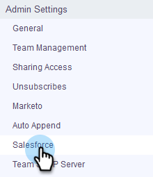

# 如何在 Salesforce 沙盒中安装自定义设置 {#how-to-install-customizations-in-your-salesforce-sandbox}

>[!NOTE]
>
>**需要管理员权限**

>[!PREREQUISITES]
>
>[将Sales Connect连接到您的Salesforce沙盒](/help/marketo/product-docs/marketo-sales-connect/crm/salesforce-customization/how-to-connect-sales-connect-to-your-salesforce-sandbox.md)

1. 在[!DNL Sales Connect]中，单击右上角的齿轮图标，然后选择&#x200B;**[!UICONTROL Settings]**。

   

1. 在[!UICONTROL Admin Settings]下，单击&#x200B;**[!UICONTROL Salesforce]**。

   

1. 单击 **[!UICONTROL Install Customizations]**。

   

   接下来，只需按照您在常规[!DNL Salesforce]帐户上的操作方式完成安装自定义设置的步骤即可。
