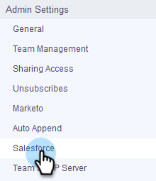

# 如何在Salesforce沙盒中安装自定义 {#how-to-install-customizations-in-your-salesforce-sandbox}

>[!NOTE]
>
>**需要管理员权限**

>[!PREREQUISITES]
>
>[将Sales Connect连接到您的Salesforce沙盒](/help/marketo/product-docs/marketo-sales-connect/crm/salesforce-customization/how-to-connect-sales-connect-to-your-salesforce-sandbox.md)

1. 在Sales Connect中，单击右上角的齿轮图标，然后选择 **设置**.

   

1. 在管理员设置下，单击 **Salesforce。**

   

1. 单击 **安装自定义**.

   

   接下来，只需像在常规Salesforce帐户中一样完成安装自定义设置的步骤即可。
