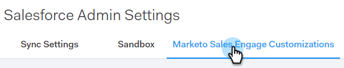

# CRM的Sales Connect自定义项 {#sales-connect-customizations-for-crm}

下面的字段和按钮由Salesforce CRM中的元数据API创建。 创建字段后，管理员必须在其CRM中配置页面布局以公开它们。 可以找到说明 [此处](https://s3.amazonaws.com/tout-user-store/salesforce/assets/Marketo+Sales+Engage+For+Salesforce_+Installation+and+Success+Guide.pdf).

>[!NOTE]
>
>这会影响ToutApp和Sales Connect客户。

## 如何在Salesforce中安装自定义项 {#how-to-install-customizations-in-salesforce}

1. 在Sales Connect中，单击齿轮图标并选择 **设置**.

   

1. 在管理设置下，选择 **Salesforce**.

   

1. 单击 **Marketo Sales Connect自定义**.

   

1. 单击 **连接到Salesforce**.

   

1. 登录到Salesforce。

   

## 更新Salesforce自定义 {#update-salesforce-customization}

对Salesforce自定义包的更新将包括增强功能和错误修复。 要检查是否有可用更新或执行更新，请执行以下步骤。

>[!NOTE]
>
>**需要管理员权限。**

1. 在 [Web应用程序](https://www.toutapp.com)，单击齿轮图标并选择 **设置**.

   

1. 在管理设置下，单击 **Salesforce**.

   

1. Sales Connect Customization卡将显示是否有更新。 单击 **更新自定义项**.

   

1. 单击 **升级**.

   

1. 等待安装更新。 根据您需要的版本号数量，安装时间会有所不同。

   

完成后，您的信息卡将显示“您的Sales Connect自定义项是最新的”。

## 自定义活动字段 {#custom-activity-fields}

Marketo将检测新字段的创建，然后执行一次性数据回填、重新映射和将值持续同步到 **新** 仅字段。 不会更新旧字段。

| **字段名称** | **描述** |
|---|---|
| MSE调用本地存在ID | 作为用户，当您从MSE电话进行呼叫时，可以选择“本地存在”作为选项。 来电将显示接收者的本地号码。 |
| MSE呼叫记录URL | 可以录制呼叫，并在此处记录录制链接。 |
| MSE营销活动 | 联系人/潜在客户所属的MSE营销活动的日志名称。 |
| MSE营销活动URL | 记录在MSE中创建的营销活动的URL。 单击此项将在MSE Web应用程序中打开营销活动。 |
| MSE营销活动当前步骤 | 如果联系人/潜在客户属于营销活动，此字段将记录该潜在客户/联系人当前所在步骤的名称。 |
| 已查看MSE电子邮件附件 | 在发送带有附件的电子邮件且收件人查看附件时记录数据。 |
| 已单击MSE电子邮件 | 当收件人单击电子邮件中的链接时，记录复选标记。 |
| MSE电子邮件已回复 | 在收件人回复电子邮件时记录复选标记。 |
| MSE电子邮件状态 | 显示电子邮件是否已发送/进行中/退回（跟踪退回的电子邮件取决于使用的投放渠道）。 |
| MSE电子邮件模板 | 发送给潜在客户/联系人的电子邮件中使用的MSE模板的日志名称。 |
| MSE电子邮件模板URL | 将URL记录到在MSE中创建的模板。 单击此项将在MSE Web应用程序中打开模板。 |
| MSE电子邮件URL | 单击此URL将在MSE中打开命令中心，并拉出“人员详细信息查看历史记录”选项卡，您可以在其中查看已发送的电子邮件。 |
| 已查看MSE电子邮件 | 在收件人查看电子邮件时记录复选标记。 |

## 汇总日志记录字段 {#roll-up-logging-fields}

<table> 
 <colgroup> 
  <col> 
  <col> 
 </colgroup> 
 <tbody> 
  <tr> 
   <td><strong>字段名称</strong></td> 
   <td><strong>描述</strong></td> 
  </tr> 
  <tr> 
   <td>MSE — 上次营销活动</td> 
   <td>上次来自营销的传入参与。 </td> 
  </tr> 
  <tr> 
   <td>MSE — 上次营销参与日期</td> 
   <td>营销活动的参与时间戳。</td> 
  </tr> 
  <tr> 
   <td>MSE — 上次营销参与说明</td> 
   <td>预订的描述。</td> 
  </tr> 
  <tr> 
   <td>MSE — 上次营销参与来源</td> 
   <td>营销参与度的来源。</td> 
  </tr> 
  <tr> 
   <td colspan="1">MSE — 上次营销参与类型</td> 
   <td colspan="1">参与类型。</td> 
  </tr> 
  <tr> 
   <td colspan="1">MSE — 按销售列出的最近一次活动 </td> 
   <td colspan="1">由Sales团队执行的最后一个传出活动。</td> 
  </tr> 
  <tr> 
   <td colspan="1">MSE — 上次回复</td> 
   <td colspan="1">销售电子邮件的最后一个电子邮件回复。</td> 
  </tr> 
  <tr> 
   <td colspan="1">MSE — 当前促销活动</td> 
   <td colspan="1">潜在客户/联系人所属的MSE营销活动的日志名称。</td> 
  </tr> 
  <tr> 
   <td colspan="1">MSE — 上一个销售项目</td> 
   <td colspan="1">来自Sales的上次传入预订。 </td> 
  </tr> 
  <tr> 
   <td colspan="1">MSE — 选择退出</td> 
   <td colspan="1">“选择禁用”字段。</td> 
  </tr> 
 </tbody> 
</table>

## 按钮 {#buttons}

| **按钮名称** | **描述** |
|---|---|
| 发送MSE电子邮件 | 从Salesforce发送销售电子邮件。 |
| 添加到MSE营销活动 | 从Salesforce添加到MSE营销活动。 |
| 推送到MSE | 将联系人从Salesforce推送到MSE。 |
| 使用MSE调用 | 从Salesforce发出销售调用。 |

## 批量操作按钮 {#bulk-action-buttons}

| **按钮名称** | **描述** |
|---|---|
| 添加到MSE营销活动 | 从Salesforce添加到MSE营销活动。 |
| 推送到MSE | 将联系人从Salesforce推送到MSE。 |

## 用户指南 {#user-guides}

[Salesforce中的MSE自定义报表](https://docs.marketo.com/display/docs/assets/mse-custom-reports-in-sf.docx)

[Salesforce的MSE](https://docs.marketo.com/display/docs/assets/mse-for-sf-classic.pdf)

[Salesforce Lightning的MSE](https://s3.amazonaws.com/tout-user-store/salesforce/assets/SF+Guide+for+Lightning.pdf)
