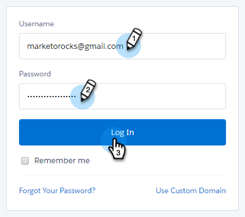

# CRM {#sales-connect-customizations-for-crm}的Sales Connect自定义

以下字段和按钮由Salesforce CRM中的元数据API创建。 创建字段后，管理员必须在其CRM中配置页面布局才能显示它们。 此处](https://docs.marketo.com/display/docs/assets/marketo-sales-engage-for-salesforce-installation-and-success-guide.pdf)可找到说明。[

>[!NOTE]
>
>这会影响ToutApp和Sales Connect客户。

## 如何在Salesforce {#how-to-install-customizations-in-salesforce}中安装自定义

1. 在Sales Connect中，单击齿轮图标，然后选择&#x200B;**设置**。

   

1. 在“管理员设置”下，选择&#x200B;**Salesforce**。

   

1. 单击&#x200B;**Marketo Sales Connect自定义**。

   

1. 单击&#x200B;**连接到Salesforce**。

   

1. 登录到Salesforce。

   

## 自定义活动字段{#custom-activity-fields}

Marketo将检测新字段的创建，然后执行一次性数据回填、重新映射以及持续将值同步到&#x200B;**new**&#x200B;字段。 旧字段将不会更新。

| **字段名称** | **说明** |
|---|---|
| MSE调用本地存在ID | 作为用户，当您从MSE Phone拨号时，可以选择“本地状态”作为选项。 来电将显示接收方的本地号码。 |
| MSE呼叫录制URL | 可以在此处录制呼叫，并记录录制的链接。 |
| MSE活动 | 联系人／潜在客户是其成员的MSE活动的日志名称。 |
| MSE活动URL | 将URL记录到在MSE中创建的活动。 单击此按钮将打开MSE Web应用程序中的活动。 |
| MSE活动当前步骤 | 如果联系人／潜在客户是活动的一部分，则此字段将记录潜在客户／联系人当前所在步骤的名称。 |
| 已查看MSE电子邮件附件 | 当电子邮件随附件发送且收件人查看附件时，记录数据。 |
| 已点击MSE电子邮件 | 当收件人单击电子邮件中的链接时，将记录一个复选标记。 |
| MSE电子邮件已回复 | 当收件人回复电子邮件时，记录一个复选标记。 |
| MSE电子邮件状态 | 显示电子邮件是否已发送／进行中／弹回(跟踪退回电子邮件取决于使用的投放渠道)。 |
| MSE电子邮件模板 | 在发送给潜在客户／联系人的电子邮件中使用的MSE模板的日志名称。 |
| MSE电子邮件模板URL | 将URL记录到在MSE中创建的模板。 单击此按钮将打开MSE Web应用程序中的模板。 |
| MSE电子邮件URL | 单击此URL将打开MSE中的命令中心，并拉出“人员详细信息视图历史记录”选项卡，在该选项卡中可以看到已发送的电子邮件。 |
| 已查看MSE电子邮件 | 当收件人视图电子邮件时，记录一个复选标记。 |

## 汇总日志记录字段{#roll-up-logging-fields}

<table> 
 <colgroup> 
  <col> 
  <col> 
 </colgroup> 
 <tbody> 
  <tr> 
   <td><strong>字段名称</strong></td> 
   <td><strong>说明</strong></td> 
  </tr> 
  <tr> 
   <td>MSE —— 上次营销参与</td> 
   <td>Marketing的最后一次参与。 </td> 
  </tr> 
  <tr> 
   <td>MSE —— 上次营销参与日期</td> 
   <td>营销活动的参与时间戳。</td> 
  </tr> 
  <tr> 
   <td>MSE —— 上次营销互动Desc</td> 
   <td>参与的描述。</td> 
  </tr> 
  <tr> 
   <td>MSE —— 最后一个营销参与源</td> 
   <td>营销参与源。</td> 
  </tr> 
  <tr> 
   <td colspan="1">MSE —— 上次营销参与类型</td> 
   <td colspan="1">参与类型。</td> 
  </tr> 
  <tr> 
   <td colspan="1">MSE —— 按销售额列出的上次活动 </td> 
   <td colspan="1">销售团队执行的上次传出活动。</td> 
  </tr> 
  <tr> 
   <td colspan="1">MSE —— 最后回复</td> 
   <td colspan="1">上次回复销售电子邮件。</td> 
  </tr> 
  <tr> 
   <td colspan="1">MSE —— 当前销售活动</td> 
   <td colspan="1">潜在客户／联系人是其成员的MSE活动的日志名称。</td> 
  </tr> 
  <tr> 
   <td colspan="1">MSE —— 上次销售参与</td> 
   <td colspan="1">销售人员最后一次参与。 </td> 
  </tr> 
  <tr> 
   <td colspan="1">MSE 选择退出 -</td> 
   <td colspan="1">退出字段。</td> 
  </tr> 
 </tbody> 
</table>

## 按钮{#buttons}

| **按钮名称** | **说明** |
|---|---|
| 发送MSE电子邮件 | 从Salesforce发送销售电子邮件。 |
| 添加到MSE活动 | 从Salesforce添加到MSE活动。 |
| 推送到MSE | 将联系人从Salesforce推送到MSE。 |
| 通过MSE呼叫 | 从Salesforce拨打销售电话。 |

## 批量操作按钮{#bulk-action-buttons}

| **按钮名称** | **说明** |
|---|---|
| 添加到MSE活动 | 从Salesforce添加到MSE活动。 |
| 推送到MSE | 将联系人从Salesforce推送到MSE。 |

## 用户指南{#user-guides}

[Salesforce中的MSE自定义报表](https://docs.marketo.com/display/docs/assets/mse-custom-reports-in-sf.docx)

[Salesforce的MSE](https://docs.marketo.com/display/docs/assets/mse-for-sf-classic.pdf)

[Salesforce闪电的MSE](https://s3.amazonaws.com/tout-user-store/salesforce/assets/SF+Guide+for+Lightning.pdf)
