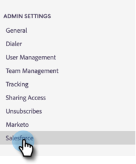

# CRM的Sales Connect自定义项 {#sales-connect-customizations-for-crm}

下面的字段和按钮由Salesforce CRM中的元数据API创建。 创建字段后，管理员必须在其CRM中配置页面布局以公开它们。 可以在此找到[说明](/help/marketo/product-docs/marketo-sales-connect/crm/salesforce-customization/assets/mse-for-sf-classic.pdf)。

## 如何在Salesforce中安装自定义项 {#how-to-install-customizations-in-salesforce}

1. 在Sales Connect中，单击齿轮图标并选择&#x200B;**设置**。

   

1. 在“管理设置”下，选择&#x200B;**Salesforce**。

   

1. 单击&#x200B;**Marketo Sales Connect自定义项**。

   

1. 单击&#x200B;**连接到Salesforce**。

   

1. 登录到Salesforce。

   

## 更新Salesforce自定义 {#update-salesforce-customization}

Salesforce自定义包的更新将包括增强功能和错误修复。 要检查是否有可用更新或执行更新，请执行以下步骤。

>[!NOTE]
>
>**需要管理员权限。**

1. 在[Web应用程序](https://www.toutapp.com)中，单击齿轮图标并选择&#x200B;**设置**。

   

1. 在“管理员设置”下，单击&#x200B;**Salesforce**。

   

1. Sales Connect Customization卡将显示是否有可用更新。 单击&#x200B;**更新自定义项**。

   

1. 单击&#x200B;**升级**。

   

1. 等待安装更新。 根据所需的版本号数量，安装时间会有所不同。

   

完成后，您的信息卡将显示“您的Sales Connect自定义项是最新的”。

## 自定义活动字段 {#custom-activity-fields}

Marketo将检测新字段的创建，然后执行一次性数据回填、重新映射和仅将值持续同步到&#x200B;**新**&#x200B;字段。 不会更新旧字段。

<table><thead>
  <tr>
    <th>字段名称</th>
    <th>描述</th>
  </tr></thead>
<tbody>
  <tr>
    <td>MSE调用本地存在ID</td>
    <td>作为用户，当您从MSE电话进行呼叫时，可以选择“本地存在”作为选项。 来电将显示接收者的本地号码。</td>
  </tr>
  <tr>
    <td>MSE呼叫录音URL</td>
    <td>可以录制呼叫，并在此处记录录制链接。</td>
  </tr>
  <tr>
    <td>MSE活动</td>
    <td>联系人/潜在客户所属的MSE营销活动的日志名称。</td>
  </tr>
  <tr>
    <td>MSE营销活动URL</td>
    <td>记录在MSE中创建的营销活动的URL。 单击此项将在MSE Web应用程序中打开营销活动。</td>
  </tr>
  <tr>
    <td>MSE营销活动当前步骤</td>
    <td>如果联系人/潜在客户属于营销策划，此字段将记录该潜在客户/联系人当前所在步骤的名称。</td>
  </tr>
  <tr>
    <td>已查看MSE电子邮件附件</td>
    <td>在发送带有附件的电子邮件且收件人查看附件时记录数据。</td>
  </tr>
  <tr>
    <td>已单击MSE电子邮件</td>
    <td>当收件人单击电子邮件中的链接时，记录复选标记。</td>
  </tr>
  <tr>
    <td>MSE电子邮件已回复</td>
    <td>在收件人回复电子邮件时记录复选标记。</td>
  </tr>
  <tr>
    <td>MSE电子邮件状态</td>
    <td>显示电子邮件是否已发送/进行中/退回（跟踪退回的电子邮件取决于使用的投放渠道）。</td>
  </tr>
  <tr>
    <td>MSE电子邮件模板</td>
    <td>发送给潜在客户/联系人的电子邮件中使用的MSE模板的日志名称。</td>
  </tr>
  <tr>
    <td>MSE电子邮件模板URL</td>
    <td>将指向MSE中创建的模板的URL记录下来。 单击此项将在MSE Web应用程序中打开模板。</td>
  </tr>
  <tr>
    <td>MSE电子邮件URL</td>
    <td>单击此URL将在MSE中打开命令中心，并拉出“人员详细信息”视图历史记录选项卡，您可以在其中查看已发送的电子邮件。</td>
  </tr>
  <tr>
    <td>已查看MSE电子邮件</td>
    <td>在收件人查看电子邮件时记录复选标记。</td>
  </tr>
</tbody></table>

## 汇总日志记录字段 {#roll-up-logging-fields}

<table><thead>
  <tr>
    <th>字段名称</th>
    <th>描述</th>
  </tr></thead>
<tbody>
  <tr>
    <td>MSE — 上次营销活动</td>
    <td>上次来自营销的传入参与。</td>
  </tr>
  <tr>
    <td>MSE — 上次营销参与日期</td>
    <td>营销活动的参与时间戳。</td>
  </tr>
  <tr>
    <td>MSE — 上次营销参与说明</td>
    <td>预订的描述。</td>
  </tr>
  <tr>
    <td>MSE — 上次营销参与Source</td>
    <td>Source营销参与度。</td>
  </tr>
  <tr>
    <td>MSE — 上次营销参与类型</td>
    <td>参与类型。</td>
  </tr>
  <tr>
    <td>MSE — 按销售列出的最近活动</td>
    <td>销售团队执行的最后一次传出活动。</td>
  </tr>
  <tr>
    <td>MSE — 上次回复</td>
    <td>销售电子邮件的最后一个电子邮件回复。</td>
  </tr>
  <tr>
    <td>MSE — 当前促销活动</td>
    <td>记录潜在客户/联系人所属的MSE营销活动的名称。</td>
  </tr>
  <tr>
    <td>MSE — 上次销售参与</td>
    <td>来自销售人员的最后一次传入预订。</td>
  </tr>
  <tr>
    <td>MSE — 选择退出</td>
    <td>“选择禁用”字段。</td>
  </tr>
</tbody></table>

## 按钮 {#buttons}

<table><thead>
  <tr>
    <th>按钮名称</th>
    <th>描述</th>
  </tr></thead>
<tbody>
  <tr>
    <td>发送MSE电子邮件</td>
    <td>从Salesforce发送销售电子邮件。</td>
  </tr>
  <tr>
    <td>添加到MSE营销活动</td>
    <td>从Salesforce添加到MSE营销活动。</td>
  </tr>
  <tr>
    <td>推送到MSE</td>
    <td>将联系人从Salesforce推送到MSE。</td>
  </tr>
  <tr>
    <td>使用MSE调用</td>
    <td>从Salesforce发出销售呼叫。</td>
  </tr>
</tbody>
</table>

## 批量操作按钮 {#bulk-action-buttons}

<table><thead>
  <tr>
    <th>按钮名称</th>
    <th>描述</th>
  </tr></thead>
<tbody>
  <tr>
    <td>添加到MSE营销活动</td>
    <td>从Salesforce添加到MSE营销活动。</td>
  </tr>
  <tr>
    <td>推送到MSE</td>
    <td>将联系人从Salesforce推送到MSE。</td>
  </tr>
</tbody>
</table>

## 用户指南 {#user-guides}

[Salesforce中的MSE自定义报表](/help/marketo/product-docs/marketo-sales-connect/crm/salesforce-customization/assets/reports-and-dashboards.pdf)

[适用于Salesforce Classic的MSE](/help/marketo/product-docs/marketo-sales-connect/crm/salesforce-customization/assets/mse-for-sf-classic.pdf)

[适用于Salesforce Lightning的MSE](/help/marketo/product-docs/marketo-sales-connect/crm/salesforce-customization/assets/sfdc-guide-lightning.pdf)
