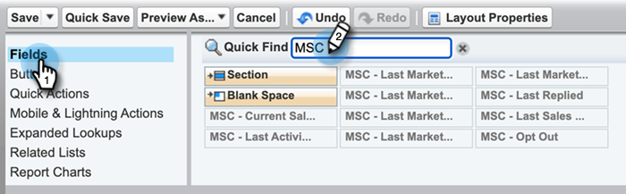

# 从Salesforce Classic卸载Marketo Sales Connect {#uninstall-marketo-sales-connect-from-salesforce-classic}

下面说明了如何在开始使用Sales Insight Actions后，从Salesforce帐户卸载Marketo Sales Connect软件包。

## 从页面布局中删除[!DNL Sales Connect]字段 {#remove-sales-connect-fields-from-page-layout}

1. 在[!DNL Salesforce] Classic中，单击&#x200B;**[!UICONTROL Setup]**。

   

1. 在左侧导航中的[!UICONTROL Build]下，展开（但不单击）[!UICONTROL Customize]，然后展开[!UICONTROL Leads]。 然后选择&#x200B;**[!UICONTROL Page Layouts]**。

   

1. 单击“潜在客户布局”旁边的&#x200B;**[!UICONTROL Edit]**。

   

1. 在控制台中选择&#x200B;**[!UICONTROL Fields]**。 在“快速查找”中，搜索“MSC”。 所有灰显的字段均已添加到您的页面布局中。 你必须删除它们。

   

   >[!NOTE]
   >
   >如果所有字段均未灰显，则表示您尚未将它们添加到页面布局。 您可以跳过此部分。

1. 滚动到包含[!DNL Sales Connect]自定义字段的部分。

   

1. 有10种类型的MSC字段可以添加到此部分中。 删除添加的所有字段，或仅删除整个部分。

1. 完成后单击&#x200B;**[!UICONTROL Quick Save]**。

   

## 从页面布局中删除[!DNL Sales Connect]按钮 {#remove-sales-connect-buttons-from-page-layouts}

1. 在控制台（上述步骤4）中，选择&#x200B;**[!UICONTROL Buttons]**。 搜索“MSC”。 所有灰显按钮已添加到您的自定义按钮部分。 你必须删除它们。

   

   >[!NOTE]
   >
   >如果没有按钮呈灰显状态，则表示您尚未添加这些按钮。 您可以跳过此部分。

1. 将MSC按钮从[!UICONTROL Custom Buttons]部分拖放到控制台。

   

1. 完成后单击&#x200B;**[!UICONTROL Quick Save]**。

   

## 从[!DNL Sales Connect]分区中删除[!UICONTROL Activity History]字段 {#remove-sales-connect-fields-from-activity-history-section}

1. 滚动到页面底部至[!UICONTROL Activity History]相关列表部分，然后单击“扳手”图标。

   

1. 从[!DNL Sales Connect]区域中选择[!UICONTROL Selected Fields]字段并单击[!UICONTROL Remove]箭头。 完成后单击&#x200B;**[!UICONTROL OK]**。

   

   >[!NOTE]
   >
   >缩写MSE _为_ [!DNL Sales Connect]。 它只是之前的名字，“Marketo Sales Engage”。

1. 完成“潜在客户”页面后，单击&#x200B;**保存**。

## 从潜在客户列表视图中删除[!DNL Sales Connect]批量操作按钮 {#remove-sales-connect-bulk-action-buttons-from-lead-list-view}

1. 在左侧导航中的[!UICONTROL Build]下，展开（但不单击）[!UICONTROL Customize]，然后展开[!UICONTROL Leads]。 然后选择&#x200B;**[!UICONTROL Search Layouts]**。

   

1. 在“潜在客户列表”视图中，单击&#x200B;**[!UICONTROL Edit]**。

   

1. 选择&#x200B;**[!UICONTROL Add to MSC Campaign (Classic)]**、**[!UICONTROL Email with MSC (Classic)]**&#x200B;和&#x200B;**[!UICONTROL Push to MSC (Classic)]**，然后单击[!UICONTROL Remove]箭头。 接着，单击 **[!UICONTROL Save]**。

   

您不会再看到潜在客户列表视图上的按钮。

## 删除联系人的MSC配置 {#remove-msc-configuration-for-contacts}

1. 在[!DNL Salesforce]中，单击&#x200B;**[!UICONTROL Setup]**。

1. 在左侧导航中的[!UICONTROL Build]下，展开（但不单击）[!UICONTROL Customize]，然后展开[!UICONTROL Contacts]。 然后选择&#x200B;**[!UICONTROL Page Layouts]**。

1. 在联系人布局旁边，单击&#x200B;**[!UICONTROL Edit]**。

1. 从所有三个部分重复步骤。

## 删除机会的MSC配置 {#remove-msc-configuration-for-opportunity}

1. 在[!DNL Salesforce]中，单击&#x200B;**[!UICONTROL Setup]**。

1. 在左侧导航中的[!UICONTROL Build]下，展开（但不单击）[!UICONTROL Customize]，然后展开[!UICONTROL Opportunities]。 然后选择&#x200B;**[!UICONTROL Page Layouts]**。

1. 在Opportunity Layout旁边，单击&#x200B;**[!UICONTROL Edit]**。

1. 从所有三个部分重复步骤。

Opportunity视图只有一个按钮 — “发送MSE电子邮件”和以下字段：

## 删除帐户的MSC配置 {#remove-msc-configuration-for-account}

1. 在[!DNL Salesforce]中，单击&#x200B;**[!UICONTROL Setup]**。

1. 在左侧导航中的[!UICONTROL Build]下，展开（但不单击）[!UICONTROL Customize]，然后展开[!UICONTROL Account]。 然后选择&#x200B;**[!UICONTROL Page Layouts]**。

1. 在帐户布局旁边，单击&#x200B;**[!UICONTROL Edit]**。

1. 从所有三个部分重复步骤。

帐户视图只有一个按钮 — “发送MSE电子邮件”和以下字段：

## 删除Marketo Sales发件箱 {#remove-marketo-sales-outbox}

1. 在[!DNL Salesforce]中，单击屏幕顶部的&#x200B;**+**&#x200B;选项卡。

1. 单击 **[!UICONTROL Customize My Tabs]**。

1. 从右侧选择Marketo销售发件箱选项。 单击[!UICONTROL Remove]箭头，然后单击&#x200B;**[!UICONTROL Save]**。

## 删除[!DNL Sales Connect]包 {#delete-sales-connect-package}

从Salesforce帐户中删除所有对象后，请执行以下步骤。

1. 在[!DNL Salesforce]中，单击&#x200B;**[!UICONTROL Setup]**。

1. 在“快速查找”框中，输入“Apex类”。

1. 单击列表中所有“MarketoSalesConnectionCustomization”或“MarketoSalesEngageCustomization”条目旁边的&#x200B;**删除**。

一切就绪！

以下是需要从Salesforce实例中删除的所有对象的列表：

## [!DNL Sales Connect]自定义项详细信息 {#sales-connect-customization-details}

<table>
 <tr>
  <th>自定义活动字段</th>
  <th>描述</th>
  <th>类型</th>
  <th>数据类型</th>
 </tr>
 <tr>
  <td>[!UICONTROL MSC Call Local Presence ID]</td>
  <td>作为用户，我可以在通过MSC电话进行呼叫时选择“本地存在”选项。 传入呼叫将显示接收者的本地号码</td>
  <td>活动</td>
  <td>文本</td>
 </tr>
 <tr>
  <td>[!UICONTROL MSC Call Recording URL]</td>
  <td>可以录制呼叫，并将此录制链接记录在此处 </td>
  <td>活动</td>
  <td>文本</td>
 </tr>
 <tr>
  <td>[!UICONTROL MSC Campaign]</td>
  <td>联系人/潜在客户所在的MSC营销活动的日志名称</td>
  <td>活动</td>
  <td>文本</td>
 </tr>
 <tr>
  <td>[!UICONTROL MSC Campaign URL]</td>
  <td>记录在MSC中创建的营销活动的URL。 单击此项将在MSC Web应用程序中打开营销活动</td>
  <td>活动</td>
  <td>文本</td>
 </tr>
 <tr>
  <td>[!UICONTROL MSC Campaign Current Step]</td>
  <td>如果联系人/商机在营销活动中，此字段将记录他们当前所在步骤的名称</td>
  <td>活动</td>
  <td>复选框</td>
 </tr>
 <tr>
  <td>[!UICONTROL MSC Email Attachment Viewed]</td>
  <td>在发送包含收件人已查看的附件的电子邮件时记录数据</td>
  <td>活动</td>
  <td>复选框</td>
 </tr>
 <tr>
  <td>[!UICONTROL MSC Email Clicked]</td>
  <td>当收件人单击电子邮件中的链接时，记录复选标记</td>
  <td>活动</td>
  <td>复选框</td>
 </tr>
 <tr>
  <td>[!UICONTROL MSC Email Replied]</td>
  <td>在收件人回复电子邮件时记录复选标记</td>
  <td>活动</td>
  <td>文本</td>
 </tr>
 <tr>
  <td>[!UICONTROL MSC Email Status]</td>
  <td>显示电子邮件是否已发送/进行中/退回（跟踪退回的电子邮件取决于使用的投放渠道）</td>
  <td>活动</td>
  <td>文本</td>
 </tr>
 <tr>
  <td>[!UICONTROL MSC Email Template]</td>
  <td>发送给潜在客户/联系人的电子邮件中使用的MSC模板的日志名称</td>
  <td>活动</td>
  <td>文本</td>
 </tr>
 <tr>
  <td>[!UICONTROL MSC Email Template URL]</td>
  <td>将URL记录到在MSC中创建的模板。 单击此项将在MSC Web应用程序中打开模板</td>
  <td>活动</td>
  <td>文本</td>
 </tr>
 <tr>
  <td>[!UICONTROL MSC Email URL]</td>
  <td>单击此URL将在MSC中打开命令中心，并拉出“人员详细信息查看历史记录”选项卡，用户可在其中查看已发送的电子邮件</td>
  <td>活动</td>
  <td>文本</td>
 </tr>
 <tr>
  <td>[!UICONTROL MSC Email Viewed]</td>
  <td>在收件人查看电子邮件时记录复选标记</td>
  <td>活动</td>
  <td>复选框</td>
 </tr>
</table>

<table>
 <tr>
  <th>MSC汇总日志记录字段</th>
  <th>描述</th>
  <th>类型</th>
  <th>数据类型</th>
 </tr>
 <tr>
  <td>MSC — 上次营销活动</td>
  <td>上次来自营销的传入参与</td>
  <td>
  
帐户 
  
联系人 
  
潜在客户 
  
机会</td>
  <td>数据和时间</td>
 </tr>
 <tr>
  <td>MSC — 上次营销参与日期</td>
  <td>营销活动的参与时间戳</td>
  <td>
  
帐户 
  
联系人 
  
潜在客户 
  
机会</td>
  <td>数据和时间</td>
 </tr>
 <tr>
  <td>MSC — 上次营销活动说明</td>
  <td>预订的描述</td>
  <td>
  
帐户 
  
联系人 
  
潜在客户 
  
机会</td>
  <td>文本</td>
 </tr>
 <tr>
  <td>MSC — 上次营销参与Source</td>
  <td>Source营销参与度</td>
  <td>
  
帐户 
  
联系人 
  
潜在客户 
  
机会</td>
  <td>文本</td>
 </tr>
 <tr>
  <td>MSC — 上次营销参与类型</td>
  <td>参与类型（例如：Web活动）</td>
  <td>
  
帐户 
  
联系人 
  
潜在客户 
  
机会</td>
  <td>文本</td>
 </tr>
 <tr>
  <td>MSC — 按销售列出的最近活动</td>
  <td>销售团队执行的最后一次传出活动</td>
  <td>
  
帐户 
  
联系人 
  
潜在客户 
  
机会</td>
  <td>数据和时间</td>
 </tr>
 <tr>
  <td>MSC — 上次回复</td>
  <td>销售电子邮件的最后一次电子邮件回复</td>
  <td>
  
帐户 
  
联系人 
  
潜在客户 
  
机会</td>
  <td>数据和时间</td>
 </tr>
 <tr>
  <td>MSC — 当前销售活动</td>
  <td>联系人/潜在客户所在的MSC营销活动的日志名称</td>
  <td>
  
帐户 
  
联系人 
  
潜在客户 
  
机会</td>
  <td>文本</td>
 </tr>
 <tr>
  <td>MSC — 上次销售参与</td>
  <td>上次来自销售人员的传入预订</td>
  <td>
  
帐户 
  
联系人 
  
潜在客户 
  
机会</td>
  <td>数据和时间</td>
 </tr>
 <tr>
  <td>MSC — 选择退出</td>
  <td>选择禁用字段</td>
  <td>
  
帐户 
  
联系人 
  
潜在客户 
  
机会</td>
  <td>复选框</td>
 </tr>
</table>

<table>
 <tr>
  <th>MSC按钮</th>
  <th>描述</th>
  <th>类型</th>
 </tr>
 <tr>
  <td>[!UICONTROL Send MSC Email]</td>
  <td>发送销售电子邮件 [!DNL Salesforce]</td>
  <td>
  
帐户 
  
联系人 
  
潜在客户 
  
机会</td>
 </tr>
 <tr>
  <td>[!UICONTROL Add to MSC Campaign]</td>
  <td>从添加到MSC营销活动 [!DNL Salesforce]</td>
  <td>
  
联系人
  
潜在客户</td>
 </tr>
 <tr>
  <td>[!UICONTROL Push to MSC]</td>
  <td>将联系人从[!DNL Salesforce]推送到MSC</td>
  <td>
  
联系人
  
潜在客户</td>
 </tr>
 <tr>
  <td>[!UICONTROL Call with MSC]</td>
  <td>从发出销售呼叫 [!DNL Salesforce]</td>
  <td>
  
联系人
  
潜在客户</td>
 </tr>
</table>

<table>
 <tr>
  <th>MSC批量操作按钮</th>
  <th>描述</th>
  <th>类型</th>
 </tr>
 <tr>
  <td>[!UICONTROL Add to MSC Campaign (Classic)]</td>
  <td>从添加到MSC营销活动 [!DNL Salesforce]</td>
  <td>
  
联系人
  
潜在客户</td>
 </tr>
 <tr>
  <td>[!UICONTROL Push to MSC (Classic)]</td>
  <td>将联系人从[!DNL Salesforce]推送到MSC</td>
  <td>
  
联系人
  
潜在客户</td>
 </tr>
 <tr>
  <td>[!UICONTROL Email with MSC (Classic)]</td>
  <td>使用MSC发送电子邮件自 [!DNL Salesforce]</td>
  <td>
  
联系人
  
潜在客户</td>
 </tr>
</table>
