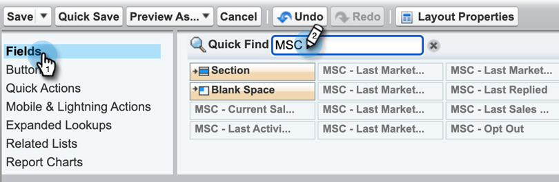
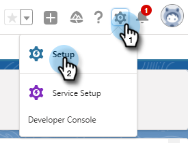

# 从 Salesforce Lightning 中卸载 Marketo Sales Connect {#uninstall-marketo-sales-connect-from-salesforce-lightning}

下面说明了如何在开始使用Sales Insight Actions后，从Salesforce帐户卸载Marketo Sales Connect软件包。

## 从页面布局中删除Sales Connect字段 {#remove-sales-connect-fields-from-page-layout}

1. 在Salesforce Lightning中，单击齿轮图标并选择&#x200B;**设置**。

   

1. 单击&#x200B;**对象管理器**。

   

1. 向下滚动到并选择&#x200B;**潜在客户**。

   

1. 单击&#x200B;**页面布局**。

   

1. 单击&#x200B;**潜在客户布局**。

   

   >[!NOTE]
   >
   >在Salesforce Lightning中，尚未更新编辑页面布局视图。

1. 在控制台中，选择&#x200B;**字段**。 在“快速查找”中，搜索“MSC”。 所有灰显的字段均已添加到您的页面布局中。 你必须删除它们。

   

   >[!NOTE]
   >
   >如果所有字段均未灰显，则表示您尚未将它们添加到页面布局。 您可以跳过此部分。

1. 滚动到包含Sales Connect自定义字段的部分。

   

1. 有10种类型的MSC字段可以添加到此部分中。 删除添加的所有字段，或仅删除整个部分。

1. 完成后单击&#x200B;**快速保存**。

   

## 从页面布局中删除Sales Connect按钮 {#remove-sales-connect-buttons-from-page-layouts}

1. 在控制台（上述步骤4）中，选择&#x200B;**按钮**。 搜索“MSC”。 所有灰显按钮已添加到您的自定义按钮部分。 你必须删除它们。

   

   >[!NOTE]
   >
   >如果没有按钮呈灰显状态，则表示您尚未添加这些按钮。 您可以跳过此部分。

1. 将MSC按钮从“Custom Buttons（自定义按钮）”部分拖放到控制台。

   

1. 完成后单击&#x200B;**快速保存**。

   

## 从“活动历史记录”部分删除Sales Connect字段 {#remove-sales-connect-fields-from-activity-history-section}

1. 滚动到页面底部的“活动历史记录”相关列表部分，然后单击“扳手”图标。

   

1. 从Selected Fields区域中选择Sales Connect Fields ，然后单击Remove箭头。 完成后单击&#x200B;**确定**。

   

   >[!NOTE]
   >
   >缩写MSE _是_ Sales Connect。 它只是之前的名字，“Marketo Sales Engage”。

1. 完成“潜在客户”页面后，单击&#x200B;**保存**。

## 从潜在客户列表视图中删除Sales Connect批量操作按钮 {#remove-sales-connect-bulk-action-buttons-from-lead-list-view}

1. 在Salesforce Lightning中，单击齿轮图标并选择&#x200B;**设置**。

   

1. 单击&#x200B;**对象管理器**。

   

1. 向下滚动到并选择&#x200B;**潜在客户**。

   

1. 单击&#x200B;**搜索布局**。

   

1. 单击“列表视图”旁边的箭头并选择&#x200B;**编辑**。

   

1. 选择&#x200B;**添加到MSC促销活动**、**使用MSC发送电子邮件**&#x200B;和&#x200B;**推送到MSC**，然后单击“删除”箭头。 然后单击&#x200B;**保存**。

   

您不会再看到潜在客户列表视图上的按钮。

## 删除联系人的MSC配置 {#remove-msc-configuration-for-contacts}

1. 在Salesforce Lightning中，单击齿轮图标并选择&#x200B;**设置**。

1. 单击&#x200B;**对象管理器**。

1. 向下滚动到并选择&#x200B;**联系人**。

1. 单击&#x200B;**页面布局**。

1. 单击&#x200B;**联系人布局**。

1. 从所有三个部分重复步骤。

## 删除机会的MSC配置 {#remove-msc-configuration-for-opportunity}

1. 在Salesforce Lightning中，单击齿轮图标并选择&#x200B;**设置**。

1. 单击&#x200B;**对象管理器**。

1. 向下滚动到&#x200B;**Opportunity**&#x200B;并选择。

1. 单击&#x200B;**页面布局**。

1. 单击&#x200B;**机会布局**。

Opportunity视图只有一个按钮 — “发送MSE电子邮件”和以下字段：

## 删除帐户的MSC配置 {#remove-msc-configuration-for-account}

1. 在Salesforce Lightning中，单击齿轮图标并选择&#x200B;**设置**。

1. 单击&#x200B;**对象管理器**。

1. 向下滚动到并选择&#x200B;**帐户**。

1. 单击&#x200B;**页面布局**。

1. 单击&#x200B;**帐户布局**。

帐户视图只有一个按钮 — “发送MSE电子邮件”和以下字段：

## 删除Marketo Sales发件箱 {#remove-marketo-sales-outbox}

1. 在Salesforce中，单击屏幕顶部的&#x200B;**+**&#x200B;选项卡。

1. 单击&#x200B;**自定义我的选项卡**。

1. 从右侧选择Marketo销售发件箱选项。 单击“移除”箭头，然后单击“**保存**”。

## 删除Sales连接包 {#delete-sales-connect-package}

从Salesforce帐户中删除所有对象后，请执行以下步骤。

1. 在Salesforce Lightning中，单击齿轮图标并选择&#x200B;**设置**。

1. 在“快速查找”框中，输入“Apex类”。

1. 单击列表中所有“MarketoSalesConnectionCustomization”或“MarketoSalesEngageCustomization”条目旁边的&#x200B;**删除**。

一切就绪！

以下是需要从Salesforce实例中删除的所有对象的列表：

## Sales Connect定制详细信息 {#sales-connect-customization-details}

<table>
 <tr>
  <th>自定义活动字段</th>
  <th>描述</th>
  <th>类型</th>
  <th>数据类型</th>
 </tr>
 <tr>
  <td>MSC呼叫本地存在ID</td>
  <td>作为用户，我可以在通过MSC电话进行呼叫时选择“本地存在”选项。 传入呼叫将显示接收者的本地号码</td>
  <td>活动</td>
  <td>文本</td>
 </tr>
 <tr>
  <td>MSC呼叫记录URL</td>
  <td>可以录制呼叫，并将此录制链接记录在此处 </td>
  <td>活动</td>
  <td>文本</td>
 </tr>
 <tr>
  <td>MSC营销活动</td>
  <td>联系人/潜在客户所在的MSC营销活动的日志名称</td>
  <td>活动</td>
  <td>文本</td>
 </tr>
 <tr>
  <td>MSC营销活动URL</td>
  <td>记录在MSC中创建的营销活动的URL。 单击此项将在MSC Web应用程序中打开营销活动</td>
  <td>活动</td>
  <td>文本</td>
 </tr>
 <tr>
  <td>MSC Campaign当前步骤</td>
  <td>如果联系人/商机在营销活动中，此字段将记录他们当前所在步骤的名称</td>
  <td>活动</td>
  <td>复选框</td>
 </tr>
 <tr>
  <td>已查看MSC电子邮件附件</td>
  <td>在发送包含收件人已查看的附件的电子邮件时记录数据</td>
  <td>活动</td>
  <td>复选框</td>
 </tr>
 <tr>
  <td>已单击MSC电子邮件</td>
  <td>当收件人单击电子邮件中的链接时，记录复选标记</td>
  <td>活动</td>
  <td>复选框</td>
 </tr>
 <tr>
  <td>MSC电子邮件已回复</td>
  <td>在收件人回复电子邮件时记录复选标记</td>
  <td>活动</td>
  <td>文本</td>
 </tr>
 <tr>
  <td>MSC电子邮件状态</td>
  <td>显示电子邮件是否已发送/进行中/退回（跟踪退回的电子邮件取决于使用的投放渠道）</td>
  <td>活动</td>
  <td>文本</td>
 </tr>
 <tr>
  <td>MSC电子邮件模板</td>
  <td>发送给潜在客户/联系人的电子邮件中使用的MSC模板的日志名称</td>
  <td>活动</td>
  <td>文本</td>
 </tr>
 <tr>
  <td>MSC电子邮件模板URL</td>
  <td>将URL记录到在MSC中创建的模板。 单击此项将在MSC Web应用程序中打开模板</td>
  <td>活动</td>
  <td>文本</td>
 </tr>
 <tr>
  <td>MSC电子邮件URL</td>
  <td>单击此URL将在MSC中打开命令中心，并拉出“人员详细信息查看历史记录”选项卡，用户可在其中查看已发送的电子邮件</td>
  <td>活动</td>
  <td>文本</td>
 </tr>
 <tr>
  <td>已查看MSC电子邮件</td>
  <td>在收件人查看电子邮件时记录复选标记</td>
  <td>活动</td>
  <td>复选框</td>
 </tr>
</table>

<table>
 <tr>
  <th>MSC汇总日志记录字段</th>
  <th>描述</th>
  <th>类型</th>
  <th>数据类型</th>
 </tr>
 <tr>
  <td>MSC — 上次营销活动</td>
  <td>上次来自营销的传入参与</td>
  <td>
  
帐户
  
联系人
  
潜在客户
  
机会</td>
  <td>数据和时间</td>
 </tr>
 <tr>
  <td>MSC — 上次营销参与日期</td>
  <td>营销活动的参与时间戳</td>
  <td>
  
帐户
  
联系人
  
潜在客户
  
机会</td>
  <td>数据和时间</td>
 </tr>
 <tr>
  <td>MSC — 上次营销活动说明</td>
  <td>预订的描述</td>
  <td>
  
帐户
  
联系人
  
潜在客户
  
机会</td>
  <td>文本</td>
 </tr>
 <tr>
  <td>MSC — 上次营销参与Source</td>
  <td>Source营销参与度</td>
  <td>
  
帐户
  
联系人
  
潜在客户
  
机会</td>
  <td>文本</td>
 </tr>
 <tr>
  <td>MSC — 上次营销参与类型</td>
  <td>参与类型（例如：Web活动）</td>
  <td>
  
帐户
  
联系人
  
潜在客户
  
机会</td>
  <td>文本</td>
 </tr>
 <tr>
  <td>MSC — 按销售列出的最近活动</td>
  <td>销售团队执行的最后一次传出活动</td>
  <td>
  
帐户
  
联系人
  
潜在客户
  
机会</td>
  <td>数据和时间</td>
 </tr>
 <tr>
  <td>MSC — 上次回复</td>
  <td>销售电子邮件的最后一次电子邮件回复</td>
  <td>
  
帐户
  
联系人
  
潜在客户
  
机会</td>
  <td>数据和时间</td>
 </tr>
 <tr>
  <td>MSC — 当前销售活动</td>
  <td>联系人/潜在客户所在的MSC营销活动的日志名称</td>
  <td>
  
帐户
  
联系人
  
潜在客户
  
机会</td>
  <td>文本</td>
 </tr>
 <tr>
  <td>MSC — 上次销售参与</td>
  <td>上次来自销售人员的传入预订</td>
  <td>
  
帐户
  
联系人
  
潜在客户
  
机会</td>
  <td>数据和时间</td>
 </tr>
 <tr>
  <td>MSC — 选择退出</td>
  <td>选择禁用字段</td>
  <td>
  
帐户
  
联系人
  
潜在客户
  
机会</td>
  <td>复选框</td>
 </tr>
</table>

<table>
 <tr>
  <th>MSC按钮</th>
  <th>描述</th>
  <th>类型</th>
 </tr>
 <tr>
  <td>发送MSC电子邮件</td>
  <td>从Salesforce发送销售电子邮件</td>
  <td>
  
帐户
  
联系人
  
潜在客户
  
机会</td>
 </tr>
 <tr>
  <td>添加到MSC营销活动</td>
  <td>从Salesforce添加到MSC营销活动</td>
  <td>
  
联系人
  
潜在客户</td>
 </tr>
 <tr>
  <td>推送到MSC</td>
  <td>将联系人从Salesforce推送到MSC</td>
  <td>
  
联系人
  
潜在客户</td>
 </tr>
 <tr>
  <td>通过MSC呼叫</td>
  <td>从Salesforce发出销售呼叫</td>
  <td>
  
联系人
  
潜在客户</td>
 </tr>
</table>

<table>
 <tr>
  <th>MSC批量操作按钮</th>
  <th>描述</th>
  <th>类型</th>
 </tr>
 <tr>
  <td>添加到MSC营销活动</td>
  <td>从Salesforce添加到MSC营销活动</td>
  <td>
  
联系人
  
潜在客户</td>
 </tr>
 <tr>
  <td>推送到MSC</td>
  <td>将联系人从Salesforce推送到MSC</td>
  <td>
  
联系人
  
潜在客户</td>
 </tr>
 <tr>
  <td>通过MSC发送电子邮件</td>
  <td>通过Salesforce的MSC发送电子邮件</td>
  <td>
  
联系人
  
潜在客户</td>
 </tr>
</table>
