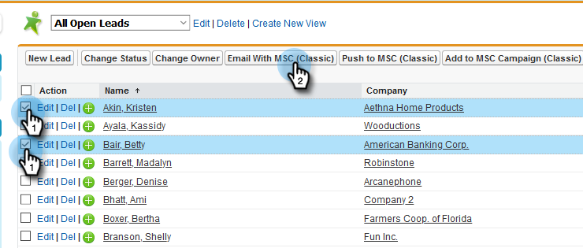
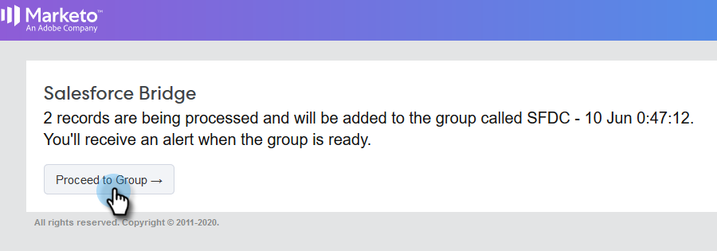

# 在Salesforce经典{#using-bulk-actions-in-salesforce-classic}中使用批量操作

了解如何执行批量操作，如向活动添加潜在客户、发送批量电子邮件或将潜在客户从Salesforce推送到Sales Connect。

>[!PREREQUISITES]
>
>更新至Sales Connect包的最新版本，并在潜在客户／联系视图中安装批量操作按钮。 [单击此处以获取说明](https://s3.amazonaws.com/tout-user-store/salesforce/assets/Marketo+Sales+Engage+For+Salesforce_+Installation+and+Success+Guide.pdf)。

>[!NOTE]
>
>在执行上述步骤之前，请确保您已登录到Marketo Sales Connect帐户。

## 批量电子邮件{#bulk-email}

1. 在Salesforce中，单击&#x200B;**Leads**&#x200B;选项卡，然后单击&#x200B;**Go**&#x200B;按钮。

   

1. 选择所需的潜在客户，然后单击&#x200B;**“用MSC(Classic)发送电子邮件”**&#x200B;按钮。

   

1. 将弹出MSC电子邮件。 它包括以下功能：

   a.“收件人”字段显示“所有收款”-此字段与您在“潜在客户列表”视图中选择的潜在客户的列表相对应\
   b.此列表显示在名为“批量合成”的左面板上——您可以在此处添加／删除收件人\
   c.您可以选择模板或创建自己的电子邮件\
   d.您可以预览将在电子邮件中填充的动态字段\
   e.您可以立即发送电子邮件或计划稍后发送该电子邮件

   

## 添加到活动{#add-to-campaign}

1. 在Salesforce中，单击&#x200B;**Leads**&#x200B;选项卡，然后单击&#x200B;**Go**&#x200B;按钮。

   

1. 选择所需的潜在客户，然后单击&#x200B;**添加到MSC活动（经典）**&#x200B;按钮。

   

1. 将出现“将人员添加到您的活动”弹出窗口。 单击&#x200B;**Next**&#x200B;并浏览典型活动流以触发MSC活动。

   

## 推送到Marketo Sales Connect {#push-to-marketo-sales-connect}

1. 在Salesforce中，单击&#x200B;**Leads**&#x200B;选项卡，然后单击&#x200B;**Go**&#x200B;按钮。

   

1. 选择所需的Lead，然后单击&#x200B;**推送到MSC(Classic)**&#x200B;按钮。

   

1. 将打开一个名为“Salesforce Bridge”的新选项卡。 单击&#x200B;**继续到组→**&#x200B;按钮。

   

1. 您将被发送到MSC帐户，在该帐户中，您将看到使用日期／时间戳创建的组。 同步完成后，您将收到通知，并且组将包含从Salesforce同步的潜在客户。

   

>[!NOTE]
>
>您也可以按照相同的步骤在“联系列表”视图中使用批量操作。

>[!MORELIKETHIS]
>
>* [通过组电子邮件发送电子邮件](/help/marketo/product-docs/marketo-sales-connect/email/using-the-compose-window/sending-emails-via-group-email.md)
>* [使用“选择并发送”编写批量电子邮件](/help/marketo/product-docs/marketo-sales-connect/email/using-the-compose-window/composing-bulk-emails-with-select-and-send.md#sending-emails)

