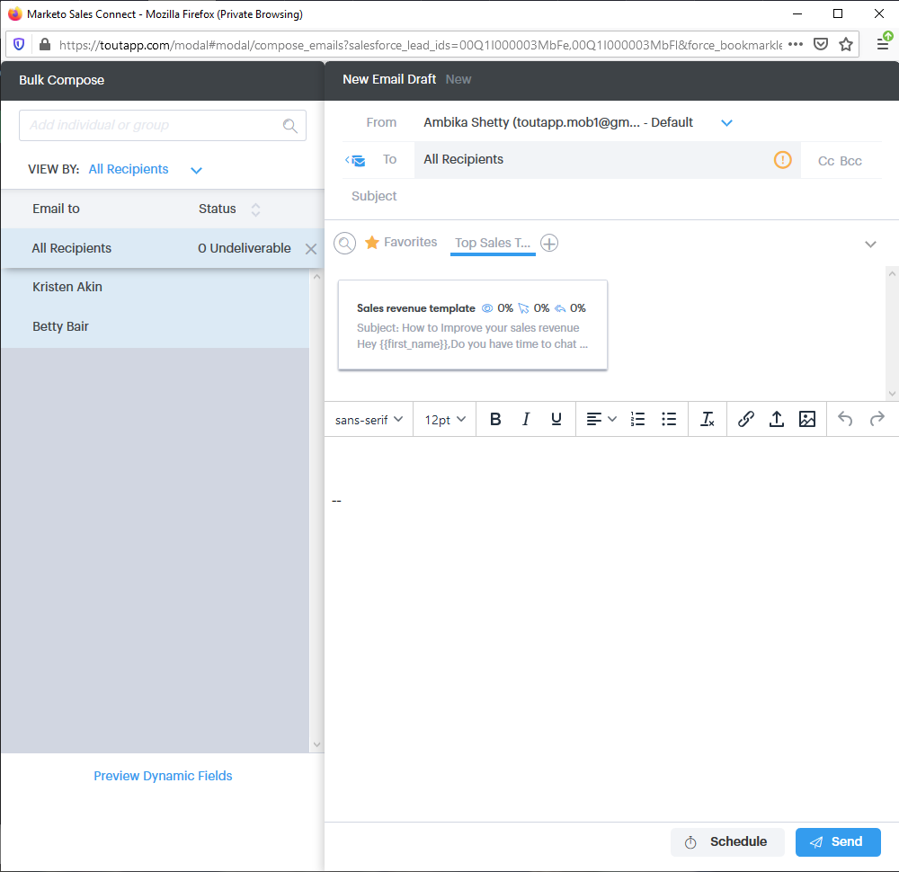

# 在[!DNL Salesforce] Classic中使用批量操作 {#using-bulk-actions-in-salesforce-classic}

了解如何执行批量操作，如将潜在客户添加到营销活动、发送批量电子邮件或将潜在客户从[!DNL Salesforce]推送到[!DNL Sales Connect]。

>[!PREREQUISITES]
>
>请更新到[!DNL Sales Connect]包的最新版本，并在潜在客户/联系人视图上安装批量操作按钮。 [单击此处获取说明](https://s3.amazonaws.com/tout-user-store/salesforce/assets/Marketo+Sales+Engage+For+Salesforce_+Installation+and+Success+Guide.pdf)。

>[!NOTE]
>
>在执行以下列出的步骤之前，请确保已登录到您的Marketo Sales Connect帐户。

## 批量电子邮件 {#bulk-email}

1. 在[!DNL Salesforce]中，单击&#x200B;**[!UICONTROL Leads]**&#x200B;选项卡，然后单击&#x200B;**[!UICONTROL Go]**&#x200B;按钮。

   

1. 选择所需的潜在客户并单击&#x200B;**[!UICONTROL Email with MSC (Classic)]**&#x200B;按钮。

   

1. 此时会弹出一个MSC电子邮件。 它包括以下功能：

   a. “[!UICONTROL To]”字段显示“[!UICONTROL All Recipients]” — 这与您在“潜在客户列表”视图中选择的潜在客户列表相对应
b.此列表在名为“[!UICONTROL Bulk Compose]”的左侧面板中可见 — 您可以在此处添加/删除收件人
c.您可以选择模板或创建自己的电子邮件
d.您可以预览将在电子邮件中填充的动态字段
e.您可以立即发送电子邮件，也可以按照计划在以后发送

   

## 添加到营销活动 {#add-to-campaign}

1. 在[!DNL Salesforce]中，单击&#x200B;**[!UICONTROL Leads]**&#x200B;选项卡，然后单击&#x200B;**[!UICONTROL Go]**&#x200B;按钮。

   

1. 选择所需的潜在客户并单击&#x200B;**[!UICONTROL Add to MSC Campaign (Classic)]**&#x200B;按钮。

   

1. 将显示“[!UICONTROL Add People to Your Campaign]”弹出窗口。 单击&#x200B;**[!UICONTROL Next]**&#x200B;并浏览典型促销活动流程以触发MSC促销活动。

   

## 推送到Marketo Sales Connect {#push-to-marketo-sales-connect}

1. 在[!DNL Salesforce]中，单击&#x200B;**[!UICONTROL Leads]**&#x200B;选项卡，然后单击&#x200B;**[!UICONTROL Go]**&#x200B;按钮。

   

1. 选择所需的潜在客户并单击&#x200B;**[!UICONTROL Push to MSC (Classic)]**&#x200B;按钮。

   

1. 将打开名为“[!UICONTROL Salesforce Bridge]”的新选项卡。 单击&#x200B;**[!UICONTROL Proceed to Group →]**&#x200B;按钮。

   

1. 系统会将您发送到您的MSC帐户，您将在其中看到一个使用日期/时间戳创建的组。 同步完成后，您将收到通知，该组将包括从[!DNL Salesforce]同步的潜在客户。

   

>[!NOTE]
>
>您也可以按照相同的步骤在联系人列表视图中使用批量操作。

>[!MORELIKETHIS]
>
>* [通过群电子邮件发送电子邮件](/help/marketo/product-docs/marketo-sales-connect/email/using-the-compose-window/sending-emails-via-group-email.md)
>* [使用Select和Send编写批量电子邮件](/help/marketo/product-docs/marketo-sales-connect/email/using-the-compose-window/composing-bulk-emails-with-select-and-send.md#sending-emails)
