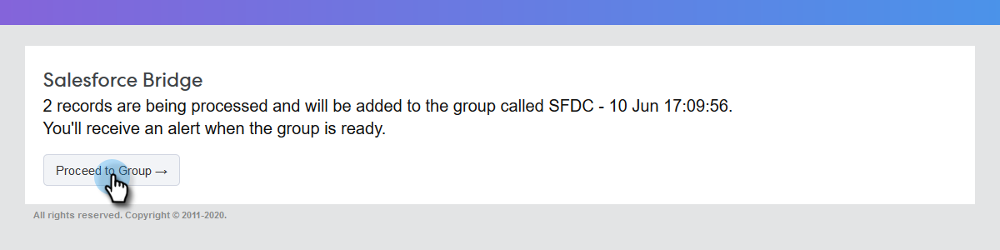

# 在[!DNL Salesforce Lightning]中使用批量操作 {#using-bulk-actions-in-salesforce-lightning}

了解如何执行批量操作，如将潜在客户添加到营销活动、发送批量电子邮件或将潜在客户从[!DNL Salesforce]推送到[!DNL Sales Connect]。

>[!PREREQUISITES]
>
>请更新到[!DNL Sales Connect]包的最新版本，并在潜在客户/联系人视图上安装批量操作按钮。
>* [英文说明](assets/SF+Guide+for+Lightning-EN)
>* [日语说明](assets/SF+Guide+for+Lightning-JA)

>[!NOTE]
>
>在执行以下步骤之前，请确保您已登录到您的[!DNL Marketo Sales Connect]帐户。

## 批量电子邮件 {#bulk-email}

1. 在[!DNL Salesforce]中，单击&#x200B;**[!UICONTROL Leads]**&#x200B;选项卡，然后选择所需潜在客户列表。

   

   >[!NOTE]
   >
   >如果您已经在要使用的列表中，则必须从下拉列表中选择它来再次执行它，以确保MSC批量操作按钮显示。 这是无法更改的[!DNL Salesforce]行为。

1. 单击下拉箭头（位于屏幕的最右侧）并选择&#x200B;**[!UICONTROL Email with MSC]**。

   

1. 此时会弹出一个MSC电子邮件。 它包括以下功能：

   a. “[!UICONTROL To]”字段显示“所有回执” — 这与您在“潜在客户列表”视图中选择的潜在客户列表相对应
b.此列表在名为“批量撰写”的左侧面板中可见 — 您可以在此处添加/删除收件人
c.您可以选择模板或创建自己的电子邮件
d.您可以立即发送电子邮件，也可以按照计划在以后发送

   

## 添加到营销活动 {#add-to-campaign}

1. 在[!DNL Salesforce]中，单击&#x200B;**[!UICONTROL Leads]**&#x200B;选项卡，然后选择所需潜在客户列表。

   

1. 单击下拉箭头（位于屏幕的最右侧）并选择&#x200B;**[!UICONTROL Add to MSC Campaign]**。

   

1. 将显示“[!UICONTROL Add People to Your Campaign]”弹出窗口。 单击&#x200B;**[!UICONTROL Next]**&#x200B;并浏览典型促销活动流程以触发MSC促销活动。

   

## 推送到[!DNL Marketo Sales Connect] {#push-to-marketo-sales-connect}

1. 在[!DNL Salesforce]中，单击&#x200B;**[!UICONTROL Leads]**&#x200B;选项卡，然后选择所需潜在客户列表。

   

1. 单击下拉箭头（位于屏幕的最右侧）并选择&#x200B;**[!UICONTROL Push to MSC]**。

   

1. 将打开名为“[!DNL Salesforce] Bridge”的新选项卡。 单击&#x200B;**[!UICONTROL Proceed to Group]→**&#x200B;按钮。

   

1. 系统会将您发送到您的MSC帐户，您将在其中看到一个使用日期/时间戳创建的组。 同步完成后，您将收到通知，该组将包括从[!DNL Salesforce]同步的潜在客户。

   

>[!NOTE]
>
>您也可以按照相同的步骤在联系人列表视图中使用批量操作。

>[!MORELIKETHIS]
>
>* [通过群电子邮件发送电子邮件](/help/marketo/product-docs/marketo-sales-connect/email/using-the-compose-window/sending-emails-via-group-email.md)
>* [使用Select和Send编写批量电子邮件](/help/marketo/product-docs/marketo-sales-connect/email/using-the-compose-window/composing-bulk-emails-with-select-and-send.md#sending-emails)
