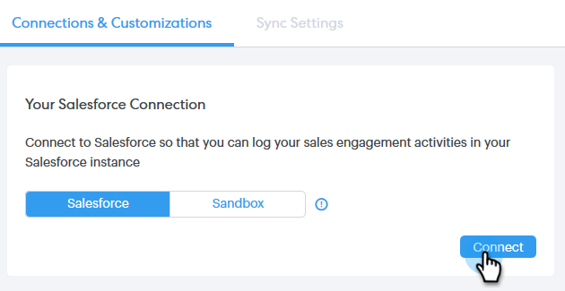

# 将您的Sales Connect帐户连接到Salesforce {#connect-your-sales-connect-account-to-salesforce}

按照以下简单步骤将Sales Connect连接到Salesforce。

## 如何以管理员身份连接 {#how-to-connect-as-an-admin}

1. 在Sales Connect中，单击右上角的齿轮图标，然后选择 **设置**.

   

1. 在管理设置下，单击 **Salesforce**.

   

1. 在“连接和定制”选项卡中，单击 **连接**.

   

1. 单击 **确定**.

   

1. 如果您已登录Salesforce，则会连接到网络。 否则，系统将要求您登录。

## 如何以非管理员身份连接 {#how-to-connect-as-a-non-admin}

1. 在Sales Connect中，单击齿轮图标并选择 **设置**.

   

1. 在我的帐户下，选择 **Salesforce**.

   

1. 在“连接和定制”选项卡中，单击 **连接**.

   

1. 单击 **确定**.

   

1. 如果您已登录Salesforce，则会连接到网络。 否则，系统将要求您登录。
