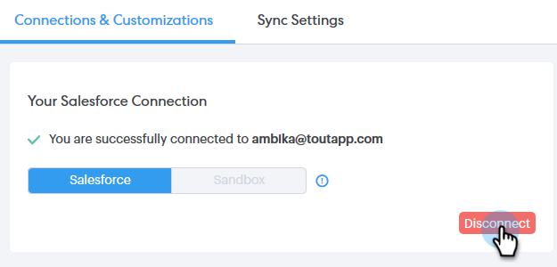

# 将Salesforce从您的Sales Connect帐户断开 {#disconnect-salesforce-from-your-sales-connect-account}

有时您可能需要将Salesforce帐户与Sales Connect帐户断开连接。 下面是具体操作方法。

## 如何以管理员身份与Salesforce断开连接 {#how-to-disconnect-from-salesforce-as-an-admin}

1. 在Sales Connect中，单击右上角的齿轮图标，然后选择 **设置**.

   

1. 在管理设置下，单击 **Salesforce**.

   

1. 在“连接和定制”选项卡中，单击 **断开连接**.

   

## 如何以非管理员身份从Salesforce断开连接 {#how-to-disconnect-from-salesforce-as-a-non-admin}

1. 在Sales Connect中，单击右上角的齿轮图标，然后选择 **设置**.

   

1. 在我的帐户下，选择 **Salesforce**.

   

1. 在“连接和定制”选项卡中，单击 **断开连接**.

   
