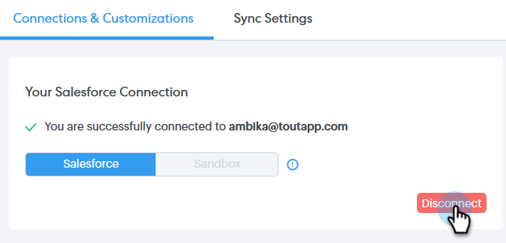
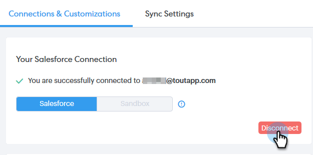

# 将 Salesforce 从您的 Sales Connect 帐户断开 {#disconnect-salesforce-from-your-sales-connect-account}

有时您可能需要断开[!DNL  Salesforce]帐户与[!DNL Sales Connect]帐户的连接。 操作方法如下：

## 如何以管理员身份与Salesforce断开连接 {#how-to-disconnect-from-salesforce-as-an-admin}

1. 在[!DNL Sales Connect]中，单击右上角的齿轮图标，然后选择&#x200B;**[!UICONTROL Settings]**。

   

1. 在[!UICONTROL  Admin Settings]下，单击&#x200B;**[!UICONTROL Salesforce]**。

   

1. 在[!UICONTROL Connections & Customizations]选项卡中，单击&#x200B;**[!UICONTROL Disconnect]**。

   

## 如何以非管理员身份断开与Salesforce的连接 {#how-to-disconnect-from-salesforce-as-a-non-admin}

1. 在[!DNL  Sales Connect]中，单击右上角的齿轮图标，然后选择&#x200B;**[!UICONTROL Settings]**。

   

1. 在[!UICONTROL My Account]下，选择&#x200B;**[!UICONTROL Salesforce]**。

   

1. 在[!UICONTROL Connections & Customizations]选项卡中，单击&#x200B;**[!UICONTROL Disconnect]**。

   
