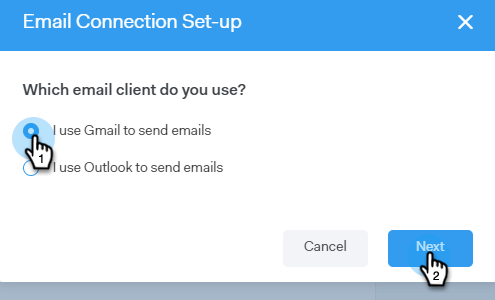

# 面向Gmail用户的电子邮件连接 {#email-connection-for-gmail-users}

连接到Gmail意味着您将收到回复跟踪、访问Gmail投放渠道、在Gmail中计划电子邮件并发送合规性的功能。

>[!CAUTION]
>
>如果您 [使用过滤器](https://support.google.com/mail/answer/6579?hl=en#zippy=%2Ccreate-a-filter%2Cedit-or-delete-filters){target=&quot;_blank&quot;}或您的Gmail帐户中用于自动将电子邮件标记为已读的规则，这可能导致回复跟踪出现问题。 我们建议禁用在Gmail中使用回复跟踪时自动将电子邮件标记为已读的任何规则。

1. 在Sales Connect中，单击齿轮图标，然后选择 **设置**.

   

1. 在“我的帐户”下，选择 **电子邮件设置**.

   

1. 单击 **电子邮件连接** 选项卡。

   

1. 单击 **入门**.

   

1. 选择 **我用Gmail发邮件** 单击 **下一个**.

   

1. 单击 **确定**.

   

1. 如果您已经登录Gmail，请选择要连接的帐户。 如果没有，请输入您的Gmail地址并单击 **下一个**. 在本例中，我们尚未登录。

   

1. 输入密码并单击 **下一个**.

   

1. 单击 **允许**.

   

   您可以使用此连接来跟踪电子邮件，也可以用作投放渠道。

>[!NOTE]
>
>Gmail强制实施自己的发送限制。 [在此处了解更多](/help/marketo/product-docs/marketo-sales-connect/email/email-delivery/email-connection-throttling.md#email-provider-limits).
