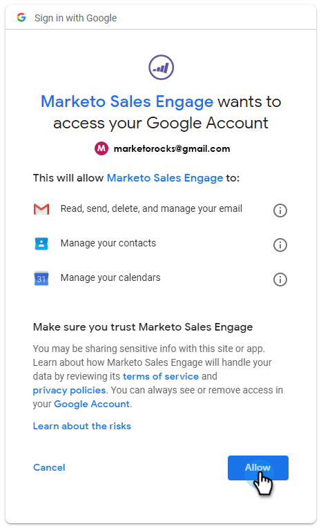

# Gmail用户的“电子邮件连接”选项卡{#email-connection-tab-for-gmail-users}

连接到Gmail意味着您将收到回复跟踪、访问Gmail投放渠道、在Gmail中计划电子邮件的能力以及发送合规性。

1. 在Sales Connect中，单击齿轮图标，然后选择&#x200B;**设置**。

   

1. 在“我的帐户”下，选择&#x200B;**电子邮件设置**。

   

1. 单击&#x200B;**电子邮件连接**&#x200B;选项卡。

   

1. 单击&#x200B;**开始**。

   

1. 选择&#x200B;**我使用Gmail发送电子邮件**，然后单击&#x200B;**下一步**。

   

1. 单击&#x200B;**确定**。

   

1. 如果您已登录到Gmail，请选择要连接的帐户。 否则，输入您的Gmail地址，然后单击&#x200B;**下一步**。 在此示例中，我们尚未登录。

   

1. 输入密码，然后单击&#x200B;**Next**。

   

1. 单击&#x200B;**允许**。

   

   您可以使用此连接跟踪电子邮件，也可以作为投放渠道。
