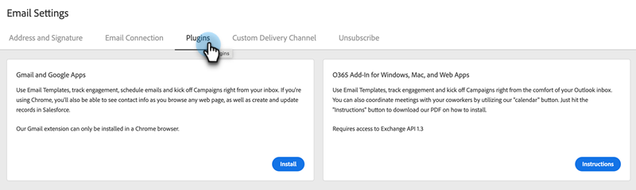

# 为 Gmail 安装 Sales Connect 电子邮件插件 {#install-the-sales-connect-email-plugin-for-gmail}

了解如何安装Gmail插件。

>[!IMPORTANT]
>
>只有Marketo Sales Connect用户支持Gmail和Outlook的电子邮件插件。 Sales Insight Actions用户&#x200B;**不支持**。

1. 在[Web应用程序](https://toutapp.com/next#settings)中，单击齿轮图标，然后单击&#x200B;**[!UICONTROL Settings]**。

   

1. 在“我的帐户”下，单击&#x200B;**[!UICONTROL Email Settings]**。

   

1. 单击&#x200B;**[!UICONTROL Plugins]**&#x200B;选项卡。

   

1. 在“Gmail和Google应用程序”下，单击&#x200B;**[!UICONTROL Install]**。

   
