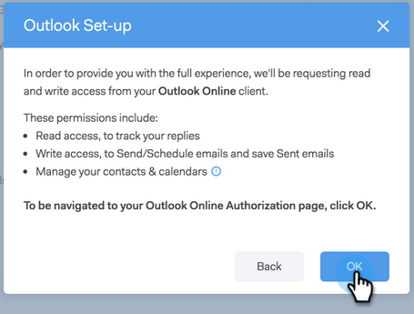

# 面向Outlook用户的电子邮件连接 {#email-connection-for-outlook-users}

了解如何将Sales Connect帐户与Outlook连接。

>[!NOTE]
>
>每个用户都需要从其Sales Connect帐户连接到Outlook。

## 连接到Outlook Online {#connecting-to-outlook-online}

连接到Outlook意味着您将收到回复跟踪、访问Outlook投放渠道、在Outlook中计划电子邮件和发送合规性的功能。

1. 在Sales Connect中，单击齿轮图标，然后选择 **设置**.

   

1. 在“我的帐户”下，选择 **电子邮件设置**.

   

1. 单击 **电子邮件连接** 选项卡。

   

1. 单击 **入门**.

   

1. 选择 **我使用Outlook发送电子邮件** 单击 **下一个**.

   

1. 选择您正在使用的Outlook版本，然后单击 **下一个**. 在本例中，我们选择Outlook Online。

   

   <table> 
    <tbody>
     <tr>
      <td><strong>Outlook Online</strong></td> 
      <td>也称为Exchange Online</td> 
     </tr>
     <tr>
      <td><strong>内部部署Exchange</strong></td> 
      <td>包括Exchange 2013和2016</td> 
     </tr>
    </tbody>
   </table>

   >[!NOTE]
   >
   >Marketo当前不支持Exchange混合帐户。

1. 单击 **确定**.

   

1. 如果您未登录Outlook，请输入登录信息并单击 **下一个**. 如果您是，请选择要连接的帐户并单击 **下一个**. 在本例中，我们已经登录。

   

1. 单击 **接受**.

   

   您可以使用此连接来跟踪电子邮件，也可以用作投放渠道。

   >[!NOTE]
   >
   >Outlook Online(Office365)强制实施自己的发送限制。 [在此处了解更多](/help/marketo/product-docs/marketo-sales-connect/email/email-delivery/email-connection-throttling.md#email-provider-limits).

## 连接到Exchange本地版 {#connecting-to-exchange-on-premise}

连接到Exchange On-Premise意味着您将收到回复跟踪、访问Outlook投放渠道、在Outlook中计划电子邮件和发送合规性的功能。

1. 在Sales Connect中，单击齿轮图标，然后选择 **设置**.

   

1. 在“我的帐户”下，选择 **电子邮件设置**.

   

1. 单击 **电子邮件连接** 选项卡。

   

1. 单击 **入门**.

   

1. 选择 **我使用Outlook发送电子邮件** 单击 **下一个**.

   

1. 选择您正在使用的Outlook版本，然后单击 **下一个**. 在本例中，我们选择的是Exchange内部部署。

   

   <table> 
    <tbody>
     <tr>
      <td><strong>Outlook Online</strong></td> 
      <td>也称为Exchange Online</td> 
     </tr>
     <tr>
      <td><strong>内部部署Exchange</strong></td> 
      <td>包括Exchange 2013和2016</td> 
     </tr>
    </tbody>
   </table>

1. 输入您的凭据并单击 **连接**.

   

   >[!NOTE]
   >
   >如果在Exchange版本下拉列表中关闭自动发现，则需要向IT部门询问Exchange URL。

   您可以使用此连接来跟踪电子邮件，也可以用作投放渠道。

   >[!NOTE]
   >
   >使用Exchange On-prem时，您的IT团队将确定您的电子邮件发送限制。
