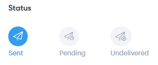

# 高级搜索概述{#advanced-search-overview}

通过利用高级搜索功能，向已查看、单击或回复电子邮件的目标潜在客户，您可以为参与度最高的潜在客户创建目标列表。

## 如何访问高级搜索{#how-to-access-advanced-search}

1. 单击&#x200B;**命令中心**。

   

1. 单击&#x200B;**电子邮件**。

   

1. 选择适用的选项卡。

   

1. 单击&#x200B;**高级搜索**。

   

## 过滤器{#filters}

**日期**

选择搜索的日期范围。 预设日期会根据您选择的电子邮件状态（已发送、未交付、待定）进行更新。

**谁**

在“人物”部分按电子邮件收件人/发件人进行筛选。

| 下拉列表 | 说明 |
|---|---|
| **视图为** | 由Sales Connect实例中的特定发件人过滤（此选项仅适用于管理员）。 |
| **按组** | 按特定收件人组过滤电子邮件。 |
| **按人员** | 按特定收件人过滤。 |

**何时**

按创建日期、交付日期、失败日期或计划日期进行选择。 可用选项会根据您选择的电子邮件状态（“已发送”、“未交付”、“待定”）而发生更改。

**活动**

按活动参与筛选电子邮件。

**状态**

有三种电子邮件状态可供选择。 类型/活动选项会根据所选状态而更改。

***状态：已发送***

过滤器。 您可以选择视图/无视图、单击／无点击和／或回复／无回复。

***状态：待定***

过滤器。

| 状态 | 说明 |
|---|---|
| **已计划** | 已从合成窗口（Salesforce或Web应用程序）、电子邮件插件或活动计划的电子邮件。 |
| **草稿** | 当前处于草稿状态的电子邮件。 电子邮件需要主题行和收件人才能保存为草稿。 |
| **进行中** | 正在发送的电子邮件。 电子邮件不应在几秒钟内保持此状态。 |

***状态：未交付***

过滤器来自从未送达的电子邮件。

| 状态 | 说明 |
|---|---|
| **失败** | 从Sales Connect发送电子邮件失败时(常见原因包括：正在发送给取消订阅／阻止的联系人的电子邮件，或者填充动态字段时出现问题)。 |
| **退回** | 当电子邮件被收件人的服务器拒绝时，该电子邮件会标记为退回。 此处只显示通过Sales Connect服务器发送的电子邮件。 |
| **垃圾邮件** | 当收件人将电子邮件标记为垃圾邮件（主动提供电子邮件的常用术语）时。 此处只显示通过Sales Connect服务器发送的电子邮件。 |

## 保存的搜索{#saved-searches}

下面介绍如何创建保存的搜索。

1. 所有过滤器都到位后，单击&#x200B;**将过滤器另存为**。

   

1. 为搜索指定名称，然后单击“保存&#x200B;**”。**

   

   保存的搜索将显示在左侧的提要栏中。

   
