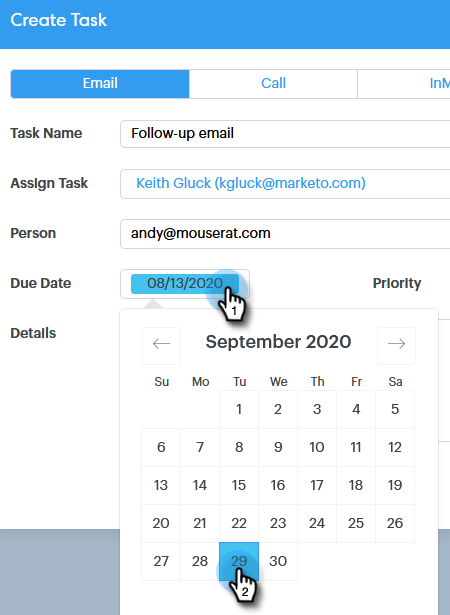

# 将任务分配给团队成员 {#assigning-tasks-to-team-members}

如果要与其他团队成员协作，分配任务是协调潜在客户工作的极好方式。

>[!NOTE]
>
>您只能为共享联系人分配任务。

1. 单击&#x200B;**命令中心**。

   

1. 单击&#x200B;**添加任务**。

   

1. 选择任务类型。

   

1. 为任务命名。

   

1. 在“分配任务”(Assign Task)字段中，选择要将任务分配到的团队人员。

   

1. 在“人员”字段中添加要联系的人员。

   

1. 选择到期日。

   

1. 设置优先级。

   

1. 添加任何与队友相关的重要详细信息（可选），然后单击&#x200B;**创建**。

   
