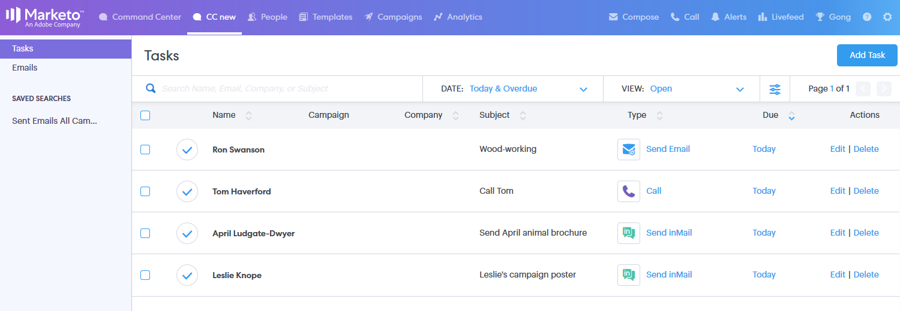

# 命令中心概述{#command-center-overview}

推荐中心是单一、统一的视图，可帮助您确定下一步，同时确保不漏水。

## 管理电子邮件{#manage-emails}

在指挥中心的电子邮件部分可以管理所有电子邮件活动。 将其视为您的电子邮件发件箱，以查看从Sales Connect发送的电子邮件。 管理您的计划电子邮件、查看谁在处理您的电子邮件、检查所发送的电子邮件是否存在问题等。

电子邮件部分可让您对所有电子邮件进行视图，并通过主选项卡和子选项卡简化其组织，这些选项卡和子选项卡充当文件夹，根据电子邮件的状态自动存储电子邮件。

<table> 
 <colgroup> 
  <col> 
  <col> 
  <col> 
 </colgroup> 
 <tbody> 
  <tr> 
   <td title="背景颜色：灰色">
<strong>主要 </strong>
</td> 
   <td title="背景颜色：灰色">
<strong>辅助 </strong>
</td> 
   <td title="背景颜色：灰色">
<strong>说明 </strong>
</td> 
  </tr> 
  <tr> 
   <td title="背景颜色：蓝色"><strong title="">已发送</strong></td> 
   <td title="背景颜色：蓝色">已交付</td> 
   <td title="背景颜色：蓝色">已发送给收件人的电子邮件。</td> 
  </tr> 
  <tr> 
   <td title="背景颜色：蓝色"> </td> 
   <td title="背景颜色：蓝色">已存档</td> 
   <td title="背景颜色：蓝色">已由用户存档以禁用电子邮件跟踪的电子邮件。</td> 
  </tr> 
  <tr> 
   <td title="背景颜色：灰色"><strong title="">待定</strong></td> 
   <td title="背景颜色：灰色">已计划</td> 
   <td title="背景颜色：灰色">当前计划发出的电子邮件。 发送电子邮件后，会将其移至已传送的文件夹。</td> 
  </tr> 
  <tr> 
   <td title="背景颜色：灰色"> </td> 
   <td title="背景颜色：灰色">草稿</td> 
   <td title="背景颜色：灰色">
已保存为草稿的电子邮件。 <strong>注意：</strong> 只能将单个电子邮件保存为草稿。批量电子邮件（选择并发送电子邮件和组电子邮件）将不会保存为草稿。
</td> 
  </tr> 
  <tr> 
   <td title="背景颜色：灰色"> </td> 
   <td title="背景颜色：灰色">进行中</td> 
   <td title="背景颜色：灰色">这是电子邮件处于发送动作时进入的中间状态。 电子邮件只应持续几分钟。</td> 
  </tr> 
  <tr> 
   <td title="背景颜色：蓝色"><strong title="">未交付</strong></td> 
   <td title="背景颜色：蓝色">失败</td> 
   <td title="背景颜色：蓝色">无法投递的电子邮件。</td> 
  </tr> 
  <tr> 
   <td title="背景颜色：蓝色"> </td> 
   <td title="背景颜色：蓝色">退回</td> 
   <td title="背景颜色：蓝色">
已从收件人电子邮件服务器拒绝的电子邮件。  <strong>注意：</strong> 仅当您是传统ToutApp用户并且作为投放渠道有权访问MSC Servers时，才会检测到此问题。
</td> 
  </tr> 
  <tr> 
   <td title="背景颜色：蓝色"> </td> 
   <td title="背景颜色：蓝色">垃圾邮件</td> 
   <td title="背景颜色：蓝色">
收件人已手动标记为垃圾邮件的电子邮件。 <strong>注意：</strong> 仅当您是传统ToutApp用户并且作为投放渠道有权访问MSC Servers时，才会检测到此问题。
</td> 
  </tr> 
 </tbody> 
</table>

## 管理任务{#manage-tasks}

任务部分是您管理和完成任务的一站式商店。 您可以在此无缝管理任务，以提高工作效率并专注于最相关的项目。

## 与参与潜在客户的后续工作{#follow-up-with-engaged-prospects}

在您通过合成窗口或潜在客户开始与活动互动后，您可以开始，利用高级搜索功能重新目标参与度最高的潜在客户。

例如，如果您在MSC中向活动添加100人，您可能希望重新目标查看并点击您电子邮件的人员，但没有回复。 为此，您可以利用活动过滤器以及视图和单击状态活动过滤器来标识要重新目标的列表。

奖励：如果保存高级搜索，则在收件人视图或单击电子邮件后，该搜索将作为动态列表工作，并添加符合参与标准的电子邮件。

>[!MORELIKETHIS]
>
>* [任务](/help/marketo/product-docs/marketo-sales-connect/tasks/syncing-sales-connect-tasks-with-salesforce-for-the-first-time.md)
>* [高级搜索概述](/help/marketo/product-docs/marketo-sales-connect/email/command-center/advanced-search-overview.md)
>* [使用“选择并发送”编写批量电子邮件](/help/marketo/product-docs/marketo-sales-connect/email/using-the-compose-window/composing-bulk-emails-with-select-and-send.md)

