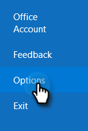
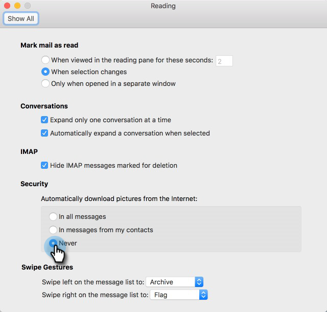

# 防止自我查看 {#preventing-self-views}

## 概述 {#overview}

获取视图跟踪的误报可能会导致报表不一致。 当MSC的用户意外从其电子邮件客户端调用跟踪像素时，经常会发生这种情况（我们称之为自查看）。 下面是有关大幅减少甚至消除自我看法的一些提示。

## Web （[!DNL Outlook Web App]和Gmail） {#web-outlook-web-app-and-gmail}

[!DNL Sales Connect]将在浏览器中存储Cookie，以防止在从Outlook Web App和Gmail打开电子邮件时跟踪查看次数。 如果您仍在接收自检信息，我们建议您执行以下操作：

* 确保您的计算机上启用了Cookie。

* 如果您使用的是新计算机或移动设备，请确保您已登录Web应用程序。 这将允许我们以后识别您的计算机/设备。

## 桌面(Windows) {#desktop-windows}

通过在电子邮件客户端中下载一个不可见的小图像像素来跟踪视图。 通过禁用自动下载的图像，可以显着降低[!DNL Outlook]中的自检次数。 以下是操作步骤。

1. 在[!DNL Outlook]中，单击菜单栏中的&#x200B;**[!UICONTROL File]**。

   

1. 单击 **[!UICONTROL Options]**。

   

1. 在[!DNL Outlook]选项对话框中，单击&#x200B;**[!UICONTROL Trust Center]**。

   

1. 在[!UICONTROL Microsoft Outlook Trust Center]下，单击&#x200B;**[!UICONTROL Trust Center Settings]**。

   

1. 单击左侧菜单中的[!UICONTROL Automatic Download]，然后选中&#x200B;**[!UICONTROL Don't download pictures automatically in HTML email or RSS items]**&#x200B;复选框。

   

1. 在&#x200B;**[!UICONTROL OK]**&#x200B;对话框中单击[!UICONTROL Trust Center]。

   

1. 在&#x200B;**[!UICONTROL OK]**&#x200B;选项对话框中单击[!DNL Outlook]。

   

## 桌面(Mac) {#desktop-mac}

通过在电子邮件客户端中下载一个不可见的小图像像素来跟踪视图。 通过禁用自动下载的图像，可以显着降低[!DNL Outlook]中的自检次数。 以下是操作步骤。

1. 在[!DNL Outlook]中，单击菜单栏中的&#x200B;**[!UICONTROL Outlook]**&#x200B;并选择&#x200B;**[!UICONTROL Preferences]**。

   

1. 在[!UICONTROL Email]下，选择&#x200B;**[!UICONTROL Reading]**。

   

1. 在[!UICONTROL Security]下，单击&#x200B;**[!UICONTROL Never]**&#x200B;单选按钮。

   
