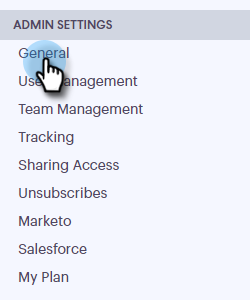

# 设置自定义发送渠道 {#setting-up-a-custom-delivery-channel}

[!DNL Marketo Sales Connect]允许您与自定义SMTP服务器集成，以传递电子邮件。 对于不希望从Gmail或[!DNL Exchange]投放渠道发送批量电子邮件的用户，这是一个很好的选项。

用户可以设置自定义SMTP服务器以供其单独使用，或者管理员可以设置团队SMTP以在实例中的所有[!DNL Sales Connect]用户之间共享。

>[!NOTE]
>
>* 除了设置SMTP服务器之外，在发送电子邮件之前，还必须验证您的[电子邮件身份](/help/marketo/product-docs/marketo-sales-connect/getting-started/email-settings/verify-your-email.md)。
>* 我们建议与您的IT团队或SMTP服务器供应商合作，以获取SMTP服务器的正确服务器凭据。
>* 无法使用SMTP服务器凭据连接Gmail和[!DNL Exchange]服务器。 请使用我们的电子邮件连接服务与这些提供商集成。

## 自定义SMTP {#custom-smtp}

1. 登录到[Web应用程序](https://toutapp.com/login)，单击右上角的齿轮图标，然后选择&#x200B;**[!UICONTROL Settings]**。

   

1. 在[!UICONTROL My Account]下，单击&#x200B;**[!UICONTROL Email Settings]**。

   

1. 单击 **[!UICONTROL Custom Delivery Channel]**。

   

1. 输入您的[!UICONTROL SMTP Server]凭据，然后单击&#x200B;**[!UICONTROL Connect]**。

   

   >[!NOTE]
   >
   >如果这是您唯一的投放渠道，则会自动将其分配给您的所有电子邮件身份，您已经完成此操作。 如果这不是您唯一的投放渠道，请继续执行步骤5。

1. 保持[!UICONTROL Email Settings]状态，单击&#x200B;**[!UICONTROL Address and Signature]**。

   

1. 查找要为其选择传递渠道的电子邮件标识，然后单击&#x200B;**[!UICONTROL Choose Delivery Channel]**。

   

1. 在[!UICONTROL Deliverability]信息卡中，单击&#x200B;**[!UICONTROL Edit]**。

   

1. 单击[!UICONTROL Channel]下拉列表，然后选择您刚刚添加的自定义投放渠道。 单击 **[!UICONTROL Save]**。

   

   >[!NOTE]
   >
   >如果您的团队管理员设置了Team SMTP Server，则它仅自动应用于您的默认电子邮件标识，并且可用作您的其他电子邮件标识的选项。

## Team SMTP服务器 {#team-smtp-server}

>[!NOTE]
>
>**需要管理员权限**

1. 登录到[Web应用程序](https://toutapp.com/login)，单击右上角的齿轮图标，然后选择&#x200B;**[!UICONTROL Settings]**。

   

1. 在[!UICONTROL Admin Settings]下，单击&#x200B;**[!UICONTROL General]**。

   

1. 单击 **[!UICONTROL Team Delivery Channel]**。

   

1. 输入您的[!UICONTROL SMTP Server]凭据，然后单击&#x200B;**[!UICONTROL Connect]**。

   

   >[!NOTE]
   >
   >团队SMTP服务器将是所有团队成员默认电子邮件标识的默认投放渠道。 此外，它还将作为所有其他电子邮件身份的投放渠道选项提供。

   >[!MORELIKETHIS]
   >
   >* Gmail用户的[电子邮件连接](/help/marketo/product-docs/marketo-sales-connect/email-plugins/gmail/email-connection-for-gmail-users.md)
   >
   >* [用户 [!DNL Outlook] 的](/help/marketo/product-docs/marketo-sales-connect/email-plugins/msc-for-outlook/email-connection-for-outlook-users.md)电子邮件连接
