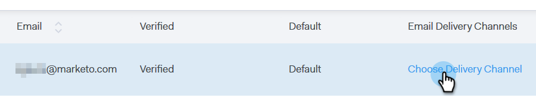
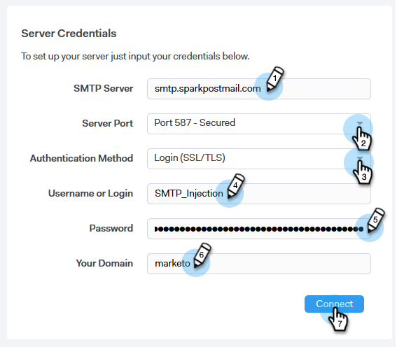
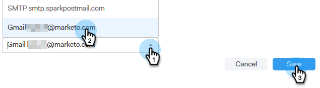

# 设置投放渠道{#setting-up-your-delivery-channel}

使用Marketo Sales Connect进行开始时，您需要设置SMTP服务器才能发出电子邮件。

>[!NOTE]
>
>除了设置SMTP服务器，还必须验证[电子邮件标识，然后才能发送电子邮件。](/help/marketo/product-docs/marketo-sales-connect/getting-started/email-settings/verify-your-email.md)

您可以选择使用自定义SMTP服务器、团队SMTP服务器或Gmail作为投放渠道发送电子邮件。 让我们看一下每个选项。

## 自定义SMTP {#custom-smtp}

1. 登录到[Web应用程序](https://toutapp.com/login)，单击右上方的齿轮图标，然后选择&#x200B;**设置**。

   

1. 在“我的帐户”下，单击“电子邮件设置”**。**

   

1. 选择&#x200B;**SMTP服务器**。

   

1. 输入SMTP服务器凭据，然后单击&#x200B;**Connect**。

   

   >[!NOTE]
   >
   >如果这是您唯一的投放渠道，它会自动分配给您的所有电子邮件身份，您就完成了。 如果这不是您唯一的投放渠道，请继续执行步骤5。

1. 仍在“电子邮件设置”中，单击&#x200B;**地址和签名**。

   

1. 查找要为其选择投放渠道的电子邮件标识，然后单击&#x200B;**选择投放渠道**。

   

1. 在“可交付性卡”中，单击&#x200B;**编辑**。

   

1. 单击渠道下拉列表，然后选择您刚添加的自定义投放渠道。 单击&#x200B;**保存**。

   

   >[!NOTE]
   >
   >如果您的团队管理员设置了团队SMTP服务器，它将自动仅应用于您的默认电子邮件标识，并可作为其他电子邮件标识的选项。

## 团队SMTP服务器{#team-smtp-server}

>[!NOTE]
>
>**需要管理员权限**

1. 登录到[Web应用程序](https://toutapp.com/login)，单击右上方的齿轮图标，然后选择&#x200B;**设置**。

   

1. 在“管理设置”下，单击&#x200B;**团队SMTP服务器**。

   

1. 输入SMTP服务器凭据，然后单击&#x200B;**Connect**。

   

   >[!NOTE]
   >
   >团队SMTP服务器将是所有团队成员默认电子邮件标识的默认投放渠道。 此外，它还可作为所有其他电子邮件标识的投放渠道选项。

## Gmail {#gmail}

1. 登录到[Web应用程序](https://toutapp.com/login)，单击右上方的齿轮图标，然后选择&#x200B;**设置**。

   

1. 在“我的帐户”下，单击“电子邮件设置”**。**

   

1. 单击&#x200B;**电子邮件同步**。

   

1. 单击&#x200B;**连接到Google**。

   

1. 使用Google凭据登录。

1. 进入此屏幕时，单击&#x200B;**允许**。

   

   >[!NOTE]
   >
   >如果这是您唯一的投放渠道，它会自动分配给您的所有电子邮件身份，您就完成了。 如果Gmail不是您唯一的投放渠道，请继续执行步骤7。

1. 单击&#x200B;**地址和签名**。

   

1. 单击您希望Gmail成为其投放渠道的电子邮件标识。

   

1. 当幻灯片面板打开时，向下滚动到“Deliverability Card（可交付性卡）”。

   

1. 单击“渠道”下拉框，然后选择您刚添加的Gmail投放渠道。 单击&#x200B;**保存**。

   

   >[!NOTE]
   >
   >如果您的团队管理员设置了团队SMTP服务器，它将自动仅应用于您的默认电子邮件标识，并可作为其他电子邮件标识的选项。
