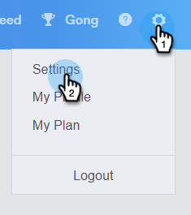

# Marketo取消订阅检查 {#marketo-unsubscribe-check}

Marketo Unsubscribe Check使用您团队与Marketo的连接，防止电子邮件发送给在Marketo的销售线索管理系统中取消订阅的人员。 当销售用户使用Sales Connect发送电子邮件时，将向Marketo发起API调用以检查电子邮件ID是否已取消订阅。 如果是，我们将阻止发送电子邮件。

>[!NOTE]
>
>**需要管理员权限**

## 打开 {#turning-it-on}

1. 在Web应用程序中，单击齿轮图标并选择 **设置**.

   

1. 在管理设置下，单击 **取消订阅**.

   

1. 单击 **集成**.

   

1. 在Marketo取消订阅检查部分中，单击滑块以激活该检查。

   

## 注意事项 {#things-to-know}

Marketo取消订阅检查……

* 不计入API限制中
* 需要建立Marketo连接
* 是全局设置
* 阻止从Web应用程序、电子邮件客户端和Salesforce发送的电子邮件
* 将记录失败的电子邮件，或者在用户尝试发送所有工作流（电子邮件插件发送、个人发送、销售活动发送、多次选择并发送）时阻止发送，但以下情况除外 [群组电子邮件](/help/marketo/product-docs/marketo-sales-connect/email/using-the-compose-window/composing-bulk-emails-with-select-and-send.md)，我们将阻止以静默方式发送电子邮件
