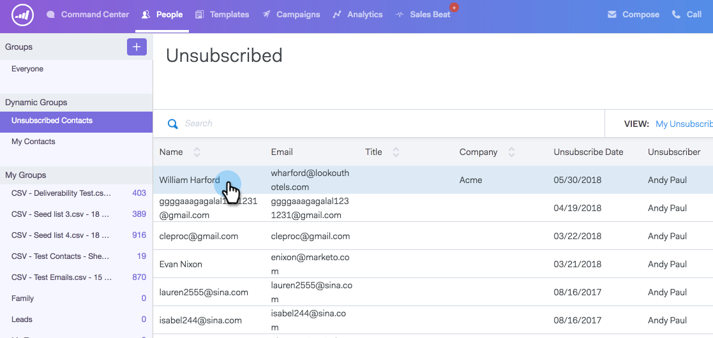

# 重新订阅取消订阅{#resubscribing-an-unsubscribe}

有时候，人们希望选择回收电子邮件。 下面介绍如何再次使取消订阅可发送。

>[!NOTE]
>
>**需要管理权限**

>[!CAUTION]
>
>在重新订阅某人之前，您应能够证明已记录重新订阅他人的授权，并遵守所有适用法律。

>[!NOTE]
>
>如果已打开取消订阅同步，则必须从ToutApp中删除取消订阅，并取选择退出消选中Salesforce中的人员记录，以便不再同步。

1. 转到[Web应用程序](https://toutapp.com/login)并单击&#x200B;**People**。

1. 选择要打开人员详细信息视图的人员。

   

1. 单击“人员详细信息”视图中的三个圆点，然后选择&#x200B;**“删除取消订阅**”。

   

1. 选择选择回访者接收电子邮件的原因，然后单击&#x200B;**删除取消订阅**。

   

>[!NOTE]
>
>如果打开了取消订阅同步，则必须取消选择退出选中Salesforce中记录中的框，否则晚间同步将重新取消订阅Sales Connect中的人员，因为它将检测该人员在Salesforce中已选择退出。 如果任一记录被/取选择退出消订阅，则同步会将链接的记录标记为这样。
