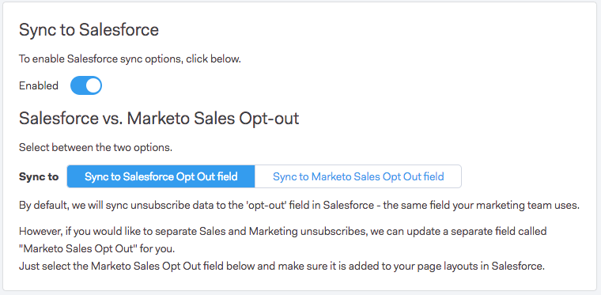

# 正在将取消订阅与Salesforce同步 {#syncing-unsubscribes-with-salesforce}

## 取消订阅同步到Salesforce的要求 {#requirements-for-unsubscribes-to-sync-to-salesforce}

* 必须启用“取消订阅同步”（用于夜间同步）
* 必须在Salesforce中安装“选择退出”字段
* Sales Connect中的人员记录必须具有Salesforce ID

**推送取消订阅**

在Sales Connect中收集取消订阅时，我们会实时将其推送到Salesforce，并更新您选择与同步的任一选择退出字段。 如果您已禁用Salesforce同步，我们仍会将取消订阅推送到电子邮件选择退出。

**取消订阅同步**

启用取消订阅同步（下面的步骤3）后，您将打开夜间同步。 同步每天在晚上8:00（太平洋标准时间）左右进行一次。 它将与Salesforce中的选择退出字段双向同步Marketo Sales中的所有取消订阅。

## 配置与Salesforce的取消订阅同步 {#configure-unsubscribe-sync-to-salesforce}

用户可以决定是要将他们的取消订阅与Marketo也可以同步的标准电子邮件选择退出字段同步，还是可以与Marketo销售选择退出字段同步，以便能够区分销售取消订阅和营销取消订阅。

1. 转到 [Web应用程序](https://toutapp.com/login)，请单击齿轮图标并选择 **设置**.

   

1. 在“管理员设置”下，选择 **取消订阅**.

   

1. 单击 **正在同步到Salesforce**，然后启用夜间同步。

   

1. 选择要同步到的字段。

   

   | 字段 | 描述 |
   |---|---|
   | **同步到Salesforce选择退出字段** | 默认选中后，只会更新Salesforce选择退出字段。 |
   | **同步到Marketo Sales Opt Out字段** | 如果要分隔销售和营销取消订阅，请选择此选项以更新其他 [Marketo Sales Opt Out字段。](#msoo) |

## 在页面布局中安装选择禁用字段 {#installing-the-opt-out-field-in-the-page-layout}

**电子邮件选择退出**

Email Opt Out是Salesforce中的一个标准字段，可从Salesforce安装。 您需要是Salesforce管理员才能安装它。

1. 转到 [Salesforce.com](https://salesforce.com) 然后登录。

   

1. 单击您的用户名并选择 **设置**.

   

1. 在快速查找框中，搜索联系人或潜在客户。 在此方案中，我们将字段安装到“联系人”页面布局，但您需要为两个人员记录进行安装。

   

1. 选择 **页面布局**.

   

1. 选择 **编辑** 在要将字段添加到的页面布局旁边。

   

1. 选择 **字段**.

   

1. 将电子邮件选择退出拖放到页面布局中。

   

1. 单击 **保存**.

   

## Marketo Sales Opt Out {#marketo-sales-opt-out}

“Marketo销售选择退出”字段是一个自定义字段，可供已安装Marketo Sales Connect自定义项的用户使用。

成功将Marketo Sales Connect自定义安装到Salesforce后，您将看到可供您使用的Marketo Sales Opt Out字段。
