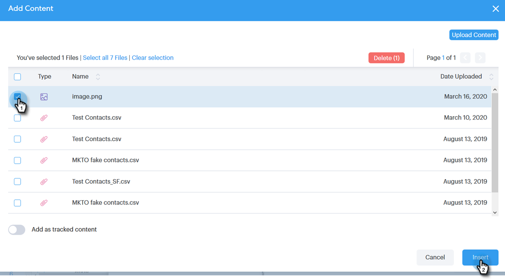

# 向电子邮件中添加附件或可跟踪内容 {#add-an-attachment-or-trackable-content-to-your-email}

通过Sales Connect发送电子邮件时，您可以选择将文件添加为附件，或将文件设为可下载（可跟踪）链接。

>[!NOTE]
>
>通常，超过20MB的任何文件都将太大，无法发送。 您可以通过电子邮件发送的附件的大小因您所使用的电子邮件投放渠道而异。

## 添加附件 {#add-an-attachment}

1. 创建电子邮件草稿（在本例中，我们选择了多种方法来执行此操作） **撰写** )。

   

1. 填写“收件人”字段并输入主题。

   

1. 单击附件图标。

   

1. 选择要附加的文件，然后单击 **插入**.

   

   >[!NOTE]
   >
   >如果需要上传文件，请单击 **上传内容** 按钮。

   

附件显示在电子邮件的底部。

## 添加可跟踪内容 {#add-trackable-content}

1. 创建电子邮件草稿（可通过多种方式执行此操作，在本例中，我们选择了撰写窗口）。

   

1. 填写“收件人”字段并输入主题。

   

1. 单击您希望显示可跟踪内容的电子邮件中的位置，然后单击附件图标。

   

1. 选择要添加的内容，单击 **跟踪内容** 滑块，然后单击 **插入**.

   

   >[!NOTE]
   >
   >如果需要上传文件，请单击 **上传内容** 按钮。

   内容会在您的电子邮件中显示为链接。 收件人可以单击链接以下载内容。

   

   >[!NOTE]
   >
   >当用户查看其跟踪的内容时，将在实时信息源中通知用户。 用户还可以在Analytics页面的内容部分中看到性能最高的内容。
