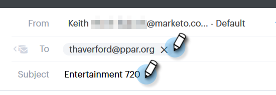

# 向电子邮件添加Highspot内容 {#adding-highspot-content-to-your-email}

如果您是Highspot客户，可以轻松地将Highspot内容插入Sales Connect电子邮件中。

1. 创建您的电子邮件草稿(可通过多种方法执行此操作，在本例中，我们选择了 **撰写** （在标题中）。

   

1. 填充“收件人”字段并输入主题。

   

1. 单击电子邮件中要插入Highspot内容的位置。 单击箭头下拉列表（附件图标旁边）并选择 **Highspot**.

   

1. 登录到您的Highspot帐户。

   

1. 选择所需的内容，然后单击 **添加内容** 按钮。

   

   >[!NOTE]
   >
   >如果您看不到要列出的内容，请使用顶部的搜索栏。

   

该内容将作为链接显示在您的电子邮件中。 收件人可以单击链接以查看/下载内容。
