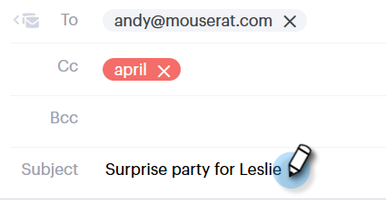

# 发送跟踪的电子邮件{#sending-a-tracked-email}

使用Marketo Sales Connect发送电子邮件时，将跟踪视图（打开电子邮件）和单击（单击链接）。

>[!PREREQUISITES]
>
>在发送跟踪的电子邮件之前，您需要验证身份并设置电子邮件投放渠道。
>
>* [验证您的电子邮件地址](/help/marketo/product-docs/marketo-sales-connect/getting-started/email-settings/verify-your-email.md)
>* 为[Outlook](/help/marketo/product-docs/marketo-sales-connect/email-plugins/msc-for-outlook/email-connection-tab-for-outlook-users.md)或[Gmail](/help/marketo/product-docs/marketo-sales-connect/email-plugins/gmail/email-connection-tab-for-gmail-users.md)设置投放渠道

1. 创建电子邮件草稿（有多种方法可以执行此操作，在此示例中，我们将在标题中选择&#x200B;**起草**）。

   

1. 在&#x200B;**至**&#x200B;字段中输入收件人的名称或电子邮件。

   

   >[!NOTE]
   >
   >在“收件人”字段中只能有一个人。

1. 在相应的字段中添加任何要抄送或密送的收件人。

   

   >[!NOTE]
   >
   >如果已通过抄送或密件抄送的人打开电子邮件，则该打开的电子邮件将作为视图记录在&#x200B;**收件人**&#x200B;字段中。

1. 添加主题行。

   

   >[!NOTE]
   >
   >发送电子邮件需要主题行和收件人。 添加主题行和收件人后，我们将&#x200B;**自动保存您的草稿**。

1. 使用编辑器撰写电子邮件。 完成后，单击&#x200B;**发送**(或[计划](/help/marketo/product-docs/marketo-sales-connect/email/using-the-compose-window/scheduling-an-email.md)，如果您愿意)。

   

   >[!MORELIKETHIS]
   >
   >* [安排电子邮件](/help/marketo/product-docs/marketo-sales-connect/email/using-the-compose-window/scheduling-an-email.md)
   >* [模板](/help/marketo/product-docs/marketo-sales-connect/templates/create-a-new-template.md)

