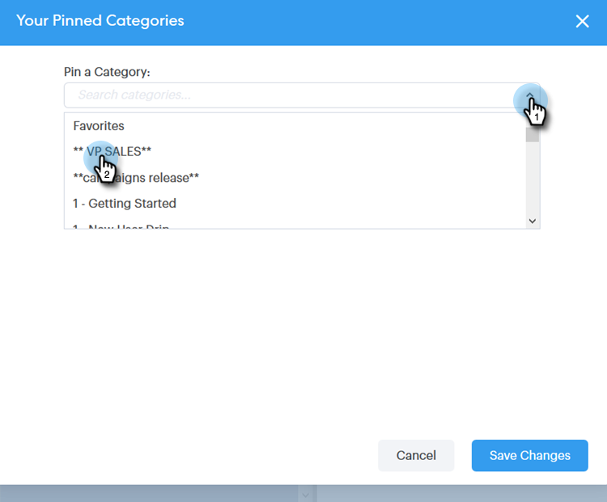

# 在撰写窗口中使用模板 {#using-a-template-in-the-compose-window}

## 查找和使用模板 {#finding-and-using-templates}

1. 创建电子邮件草稿（在本例中，我们选择了多种方法来执行此操作） **撰写** )。

   

1. 填充“收件人”字段。

   

1. 单击模板部分中的搜索图标以打开模板搜索字段。

   

1. 选择要在中搜索的类别（或选择全部以在所有类别中进行搜索）。

   

1. 按模板名称、主题行或电子邮件正文进行搜索。 单击所需的模板以将其选中。

   

   >[!NOTE]
   >
   >选择其他模板将替换编辑器中当前的所有信息。 如果进行了任何更改，请确保在选择其他模板之前复制这些更改。

## 在撰写窗口中固定模板类别 {#pinning-template-categories-in-the-compose-window}

收藏 **最多五个** 可快速访问最常用模板的特定模板类别。

1. 创建电子邮件草稿（在本例中，我们选择了多种方法来执行此操作） **撰写** )。

   

1. 单击 **+** 图标。

   

1. 单击 **固定类别** 下拉菜单，然后选择所需的类别。

   

1. 单击 **保存更改** 完成时(可选：重复步骤3以添加更多内容)。

   

   >[!TIP]
   >
   >您只需在保存更改之前拖放即可重新排列已固定的类别。

   

   >[!NOTE]
   >
   >**收藏夹** 默认情况下，为。 它包含最喜爱的电子邮件模板，而不是类别。

   您选择的类别现已固定。
