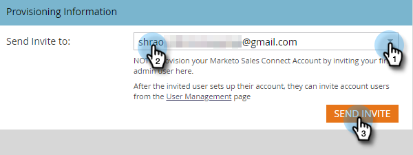

# 访问新的Sales Connect实例 {#accessing-your-new-sales-connect-instance}

>[!NOTE]
>
>**需要管理员权限。**

购买Sales Connect后，您的Marketo实例中将出现一个新的集成页面。 使用此页可邀请您的第一个用户并配置其Sales Connect实例。

1. 在Marketo中，单击 **管理员**.

   

1. 单击 **Sales Connect**.

   

1. 从要邀请的Marketo管理员列表中选择并单击 **发送邀请**.

   

用户将收到一封电子邮件，其中包含访问Sales Connect帐户的步骤。

>[!NOTE]
>
>其他用户将 **非** 通过Marketo添加，而是通过Sales Connect的User Management页面添加。 [单击此处](/help/marketo/product-docs/marketo-sales-connect/admin/invite-users.md) 了解有关添加其他用户的更多信息。
