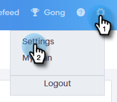
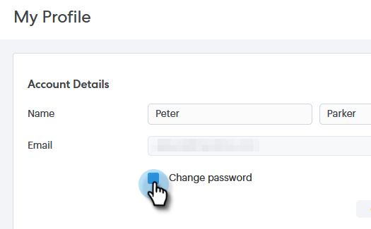
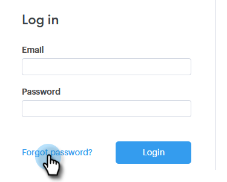
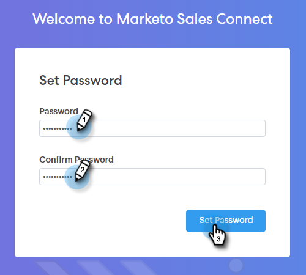

# 更改您的 Sales Connect 密码 {#change-your-sales-connect-password}

需要更改密码吗？ 操作方法如下：

## 登录时更改密码 {#change-your-password-while-signed-in}

1. 单击齿轮图标并选择&#x200B;**[!UICONTROL Settings]**。

   

1. 您的[!UICONTROL My Profile]页面默认打开。 在[!UICONTROL Account Details]下，选中&#x200B;**[!UICONTROL Change password]**&#x200B;复选框。

   

1. 输入当前密码。 然后，输入新密码，然后重新键入以确保它们匹配。 完成后，单击 **[!UICONTROL Save]**。

   

>[!NOTE]
>
>密码必须：
>
>* 至少包含九个字符
>* 使用混合大小写（UPPER和LOWER）
>* 包括一个数字
>* 使用特殊字符

## 注销时更改密码 {#change-your-password-while-signed-out}

1. 导航到[Sales Connect登录](https://toutapp.com/login)页，然后单击&#x200B;**[!UICONTROL Forgot password?]**。

   

1. 输入与帐户关联的电子邮件地址，然后单击&#x200B;**[!UICONTROL Send Reset Email]**。

   

1. 我们将发送一封电子邮件，以验证帐户所有者是否想要更改密码。 单击 **[!UICONTROL Reset Password]**。

   

   >[!NOTE]
   >
   >也请务必检查您的垃圾邮件文件夹，因为此电子邮件有时可能最终会到达该位置。

1. 输入并确认新密码。 完成后，单击 **[!UICONTROL Set Password]**。

   
