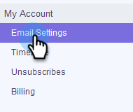

# 添加您的电子邮件签名 {#add-your-email-signature}

我们希望通过Sales Connect发送电子邮件，以便在从您自己的电子邮件客户端发送邮件时获得无缝体验。 一种有效的方法是添加您的电子邮件签名。

1. 单击齿轮图标并选择 **设置**.

   

1. 在我的帐户下，选择 **电子邮件设置**.

   

1. 单击 **地址和签名** 并选择要为其创建签名的电子邮件身份。

   

1. 在签名卡中，单击 **编辑**.

   

1. 输入所需的文本（或图像）并单击 **保存**.

   

   >[!TIP]
   >
   >确保撰写屏幕中的签名与电子邮件客户端中列出的签名类似。
