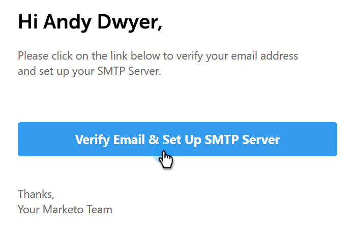

# 验证电子邮件 {#verify-your-email}

如果您的电子邮件标识未经验证，请执行以下步骤。

1. 单击右上方的齿轮图标，然后选择 **设置**.

   

1. 在“My Account（我的帐户）”下，单击 **电子邮件设置**.

   

1. 在“地址和签名”下，找到要验证的电子邮件标识并单击 **重新发送验证电子邮件**. 将发送新的验证电子邮件。

   

1. 单击 **重新发送**.

   

1. 然后，收件人打开电子邮件，并按照步骤验证电子邮件身份。

   
