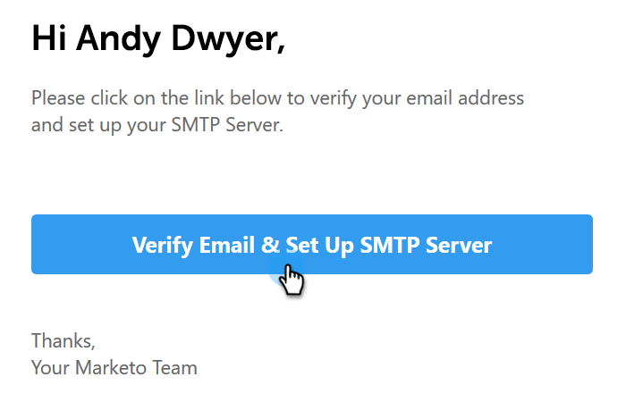

# 验证您的电子邮件 {#verify-your-email}

如果您的电子邮件标识未经验证，请按照以下步骤操作。

1. 单击右上方的齿轮图标，然后选择&#x200B;**[!UICONTROL Settings]**。

   

1. 在[!UICONTROL My Account]下，单击&#x200B;**[!UICONTROL Email Settings]**。

   

1. 在[!UICONTROL Address and Signature]下找到要验证的电子邮件标识，然后单击&#x200B;**[!UICONTROL Resend Verify Email]**。 将发送新的验证电子邮件。

   

1. 单击&#x200B;**[!UICONTROL Resend]**。

   

1. 收件人随后会打开电子邮件，并按照以下步骤验证电子邮件身份。

   
