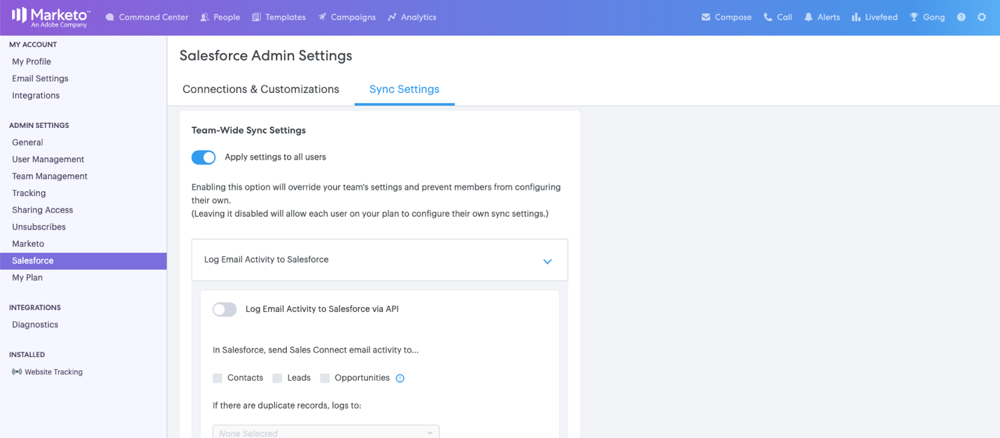

# Sales Connect管理员入门指南{#getting-started-guide-for-sales-connect-admins}

本文档将指导您完成设置新Sales Connect实例的初始步骤。 其中某些步骤需要以Marketo管理员、Salesforce管理员和Sales Connect管理员身份访问。 请按照下面的指南完成实例设置。

>[!NOTE]
>
>**需要管理员权限。**

## 访问您的新Marketo Sales Connect帐户{#accessing-your-new-marketo-sales-connect-account}

如果您已购买Marketo Sales Connect，则将从Marketo的管理员部分配置对实例的访问权限。 [单击](/help/marketo/product-docs/marketo-sales-connect/getting-started/accessing-your-new-sales-connect-instance.md) 此处查看有关Marketo管理员如何配置对新实例的访问权限的说明。

## 邀请和管理用户{#inviting-and-managing-users}

在您从Marketo配置了Marketo Sales Connect帐户并邀请了您的第一个管理员用户后，该管理员用户便可以从Marketo Sales Connect用户管理页面邀请其他用户。 [单击](/help/marketo/product-docs/marketo-sales-connect/admin/invite-users.md) 此处了解如何从用户管理页面邀请用户。

## 连接到Salesforce {#connecting-to-salesforce}

所有用户都将单独需要连接到Salesforce，以便能够将日志销售活动启用到Salesforce，如电子邮件、调用和任务。 但是，作为管理员连接到Salesforce时，您将有机会为整个团队配置活动日志记录设置，以便全局日志记录设置将应用于所有Sales Connect用户。

要将您的Sales Connect实例作为管理员或非管理员连接到Salesforce实例，请按照[本文](/help/marketo/product-docs/marketo-sales-connect/crm/salesforce-integration/connect-your-sales-connect-account-to-salesforce.md)中的步骤操作。

## 连接到Marketo {#connecting-to-marketo}

连接到Marketo将使您的销售者能够利用营销自动化和营销分析的强大力量，开展他们的潜在工作。 以下功能要求您设置与Marketo的集成。

* 与卖家共享[营销活动](/help/marketo/product-docs/marketo-sales-connect/marketo/make-a-campaign-visible-to-sales-connect-users.md)
* 将[有趣的时刻](/help/marketo/product-docs/marketo-sales-connect/marketo/interesting-moments-in-msc.md)推送到实时动态消息
* 将销售活动记录到Marketo

要了解有关如何连接到Marketo并授予销售用户访问该连接的权限的更多信息，请单击此处。

## 安装Salesforce自定义包{#installing-salesforce-customization-package}

确保成功启用销售的部分内容，是指在其主工作区中具有适当的功能。 Sales Connect自定义包允许从Salesforce访问参与能力和关键销售活动属性。

要了解有关安装Sales Connect自定义[的更多信息，请单击此处](/help/marketo/product-docs/marketo-sales-connect/crm/salesforce-customization/sales-connect-customizations-for-crm.md)。

## 在沙盒中测试{#testing-in-sandbox}

对于要使用其Marketo沙盒测试Marketo Sales Connect的团队，可以根据请求配置额外的Sales Connect帐户。 这仅适用于已购买Marketo沙盒的客户，或将其作为Marketo包一部分的客户。 如果您有兴趣获取沙盒，请联系您的Marketo客户经理。

>[!NOTE]
>
>您无法将具有相同电子邮件ID的Sales Connect帐户配置为多个实例。 这意味着，如果您希望拥有一个额外的Sales Connect帐户以通过Marketo沙盒实例进行测试，则需要在每个帐户中使用不同的电子邮件ID。

>[!MORELIKETHIS]
[管理员权限](/help/marketo/product-docs/marketo-sales-connect/admin/user-access-details.md)>
>
