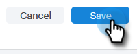

# 管理您的配置文件 {#manage-your-profile}

在“我的个人资料”页面中，您可以更新您的姓名、帐户的语言/区域设置/时区，还可以更改密码。

## 帐户详细信息 {#account-details}

您可以在此处更新您的姓名和/或密码。

1. 单击齿轮图标并选择 **设置**.

   

1. 默认情况下，将打开您的“我的配置文件”页面。 要更新您的名称，只需键入更改并单击 **保存**.

   

>[!NOTE]
>
>您的电子邮件地址设置为仅查看。 如果您也需要更改此内容，请联系 [Marketo支持](https://nation.marketo.com/t5/Support/ct-p/Support).

您还可以在此部分中更改密码。 本文档概述了这些步骤。

## 您的集成 {#your-integrations}

在页面的右侧，您的集成部分提供您帐户的所有连接的状态。

>[!NOTE]
>
>如果您正在将Exchange On Prem与Sales Connect一起使用，它将不会更新投放渠道（第1行项目）或回复跟踪（第2行项目）集成运行状况检查。 我们正努力在未来的版本中支持此功能。

## 时区 {#time-zone}

下面是如何更改帐户的语言、区域设置和/或时区。

>[!NOTE]
>
>支持的语言：英语、法语、德语、日语、葡萄牙语、西班牙语。

1. 单击齿轮图标并选择 **设置**.

   

1. 要更改您的语言，请单击 **语言** 下拉菜单中进行选择。

   

1. 此处区域设置是指使用该语言的地区。 单击 **区域设置** 下拉菜单中进行选择。

   

1. 单击 **您的时区** 下拉菜单中进行选择。

   

1. 单击 **保存** 完成时。

   

等一下！
