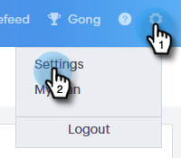

# 我的用户档案页{#my-profile-page}

在“我的用户档案”页面中，您可以更新您的名称、帐户的语言/区域设置/时区，还可以更改您的密码。

## 帐户详细信息{#account-details}

您可以在此处更新您的姓名和/或密码。

1. 单击齿轮图标，然后选择&#x200B;**设置**。

   

1. 默认情况下，将打开“我的用户档案”页面。 要更新您的名称，只需键入更改并单击&#x200B;**保存**。

   

>[!NOTE]
>
>您的电子邮件地址设置为仅视图。 如果您也需要更改，请联系[Marketo Support](https://nation.marketo.com/t5/Support/ct-p/Support)。

您还可以在本节中更改您的密码。 本文档概述了相关步骤。

## 您的集成{#your-integrations}

在页面右侧，您的集成部分提供您帐户所有连接的状态。

>[!NOTE]
>
>如果您正在Sales Connect中使用Exchange On Prem，它不会更新投放渠道（第1行项目）或回复跟踪（第2行项目）集成运行状况检查。 我们将在未来版本中支持此功能。

## 时区{#time-zone}

下面介绍如何更改帐户的语言、区域设置和/或时区。

>[!NOTE]
>
>支持的语言：英语、法语、德语、日语、葡萄牙语、西班牙语。

1. 单击齿轮图标，然后选择&#x200B;**设置**。

   

1. 要更改您的语言，请单击&#x200B;**语言**&#x200B;下拉框并做出选择。

   

1. 此处的区域设置是指使用该语言的区域。 单击&#x200B;**Locale**&#x200B;下拉框并做出选择。

   

1. 单击&#x200B;**您的时区**&#x200B;下拉列表并做出选择。

   

1. 完成后，单击&#x200B;**保存**。

   

好！
