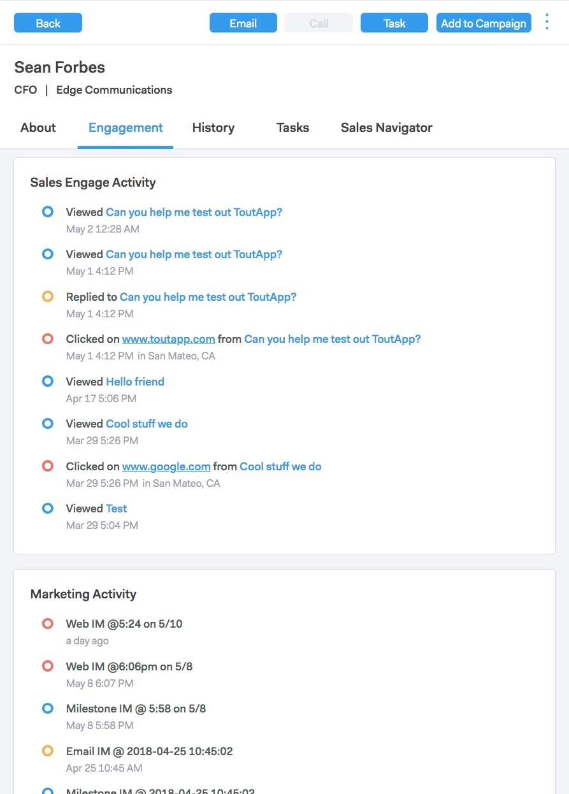

# Sales Connect概述 {#sales-connect-overview}

Marketo Sales Connect是一个多方面的销售支持解决方案，具有多种功能，可帮助您在整个销售周期中提高参与度。

>[!AVAILABILITY]
>
>并非每个人都购买了此功能。 有关详细信息，请联系Adobe客户团队（您的客户经理）。

## 实时信息源 {#the-live-feed}

销售代表可以查看 [实时参与](/help/marketo/product-docs/marketo-sales-connect/email/the-live-feed/live-feed-overview.md) 营销和销售内容。

## 人员详细信息视图 {#person-detail-view}

访问 [详细人员统计信息](/help/marketo/product-docs/marketo-sales-connect/people/person-detail-view.md).

## 在Marketo活动日志中查看结果 {#see-results-in-your-marketo-activity-log}

了解您的潜在客户与您的销售工作的配合情况。

<table> 
 <tbody> 
  <tr> 
   <th>活动类型</th> 
   <th>描述</th> 
  </tr> 
  <tr> 
   <td>
发送销售电子邮件
</td> 
   <td>
用户从Sales Connect发送了一封销售电子邮件。
</td> 
  </tr> 
  <tr> 
   <td>
打开销售电子邮件
</td> 
   <td>
潜在客户打开了从Sales Connect发送的销售电子邮件。
</td> 
  </tr> 
  <tr> 
   <td>
单击销售电子邮件
</td> 
   <td>
潜在客户单击了从Sales Connect发送的销售电子邮件中的链接。
</td> 
  </tr> 
  <tr> 
   <td colspan="1">
接收销售电子邮件
</td> 
   <td colspan="1">
潜在客户收到了从Sales Connect发送的电子邮件。
</td> 
  </tr> 
  <tr> 
   <td colspan="1">
接听销售电话
</td> 
   <td colspan="1">
潜在客户收到销售人员的电话时，使用 <a href="/help/marketo/product-docs/marketo-sales-connect/phone/sales-phone-overview.md" rel="nofollow">销售电话</a>.
</td> 
  </tr> 
  <tr> 
   <td colspan="1">
添加到销售活动
</td> 
   <td colspan="1">
潜在客户已添加到在Sales Connect中创建的Sales Campaign（在Campaigns页面中）中。
</td> 
  </tr> 
  <tr> 
   <td colspan="1">
已从销售活动中删除
</td> 
   <td colspan="1">
潜在客户已从销售活动中移除。
</td> 
  </tr> 
  <tr> 
   <td colspan="1">
有趣的时刻
</td> 
   <td colspan="1">
Lead在Marketo中创造了一个有趣的时刻。
</td> 
  </tr> 
 </tbody> 
</table>

## 共享营销活动 {#share-marketing-campaigns}

创建一个简单的智能营销活动，让您的销售用户能够访问 [Marketo促销活动数据](/help/marketo/product-docs/marketo-sales-connect/marketo/make-a-campaign-visible-to-sales-connect-users.md).

准备好开始了吗？ 有关设置说明，请单击下面的链接。

>[!MORELIKETHIS]
>
>[Sales Connect管理员入门指南](/help/marketo/product-docs/marketo-sales-connect/getting-started/getting-started-guide-for-sales-connect-admins.md)
