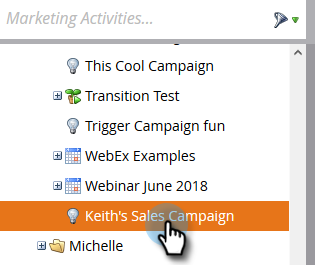

# 使营销活动对[!DNL Sales Connect]用户可见 {#make-a-campaign-visible-to-sales-connect-users}

只有当营销活动可见时，才能共享它们。 以下是具体操作方法。

1. 选择（或创建）要共享的Campaign。

   

1. 单击&#x200B;**[!UICONTROL Smart List]**&#x200B;选项卡。

   

1. 添加[!UICONTROL Campaign is Requested]触发器。

   

1. 对于源，请选择“[!UICONTROL is]”**[!UICONTROL Web Service API]**。

   

1. 单击&#x200B;**[!UICONTROL Flow]**&#x200B;选项卡。

   

1. 添加[!UICONTROL Interesting Moment]流程操作。

   

1. 对于 [!UICONTROL Type]，选择 **[!UICONTROL Web]**。

   

1. 在[!UICONTROL Description]框中，向您的销售团队写入一条消息。 在此示例中，我们使用令牌指定填写的表单。

   

1. 单击&#x200B;**[!UICONTROL Schedule]**&#x200B;选项卡，然后单击&#x200B;**[!UICONTROL Activate]**&#x200B;营销活动。

   
