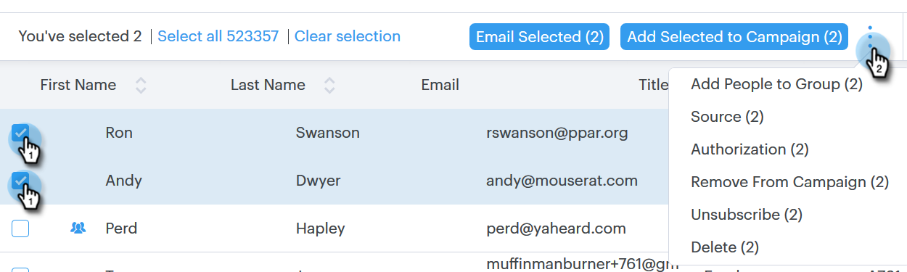

# 对人员执行批量操作{#bulk-actions-on-people}

您可以批量处理您的联系人，以节省时间。

所有可用的批量操作的第一步是选择两个或更多个联系人，然后单击数据（三个垂直点）。

## 将人员添加到组{#add-people-to-group}

同时向组添加多个人。

## 源{#source}

我们会自动为进入数据库的每个联系人分配一个源。 使用此步骤更新该源。

>[!NOTE]
>
>源不可自定义。

## 授权{#authorization}

根据[GDPR](https://eugdpr.org/)，使用授权指示您如何获得与这些联系人互动的许可。

## 取消订阅{#unsubscribe}

对不再希望收到您通信的联系人执行批量取消订阅。

## 删除{#delete}

批量删除联系人。 可以在[此处找到完整步骤。](/help/marketo/product-docs/marketo-sales-connect/people/managing-contacts/creating-and-deleting-contacts.md)

