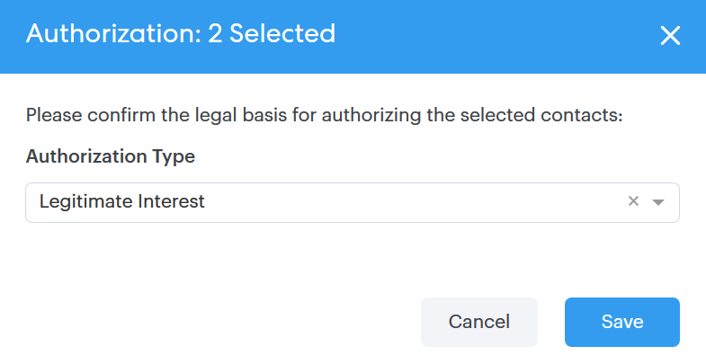

# 对人员进行批量操作 {#bulk-actions-on-people}

您可以批量处理联系人以节省时间。

所有可用批量操作的第一步是选择两个或多个联系人，然后单击数据（三个垂直点）。

## 将人员添加到组 {#add-people-to-group}

同时向组添加多个人。

## 源 {#source}

我们会自动为进入数据库的每个联系人分配一个源。 使用此步骤更新该源。

>[!NOTE]
>
>源不可自定义。

## 授权 {#authorization}

为遵守 [GDPR](http://eugdpr.org/)，请使用授权来指示您如何获得与这些联系人互动的许可。

## 取消订阅 {#unsubscribe}

对不再希望收到您通信的联系人执行批量取消订阅。

## 删除 {#delete}

批量删除联系人。 此处可找到完整 [步骤](http://docs.marketo.com/display/DOCS/How+to+Add+or+Delete+Contacts#HowtoAddorDeleteContacts-DeletingContacts)。

